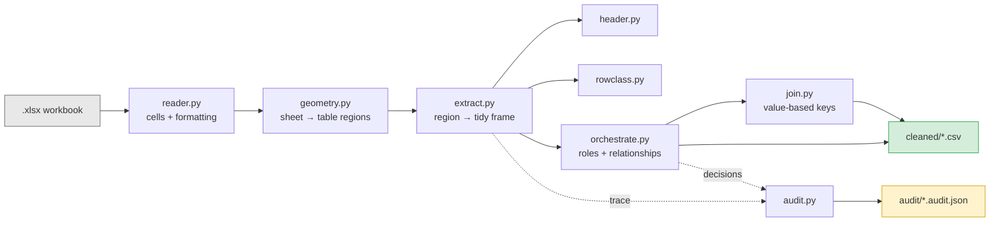
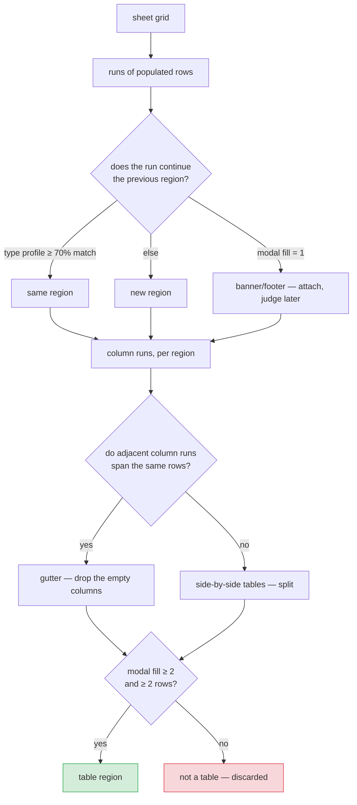
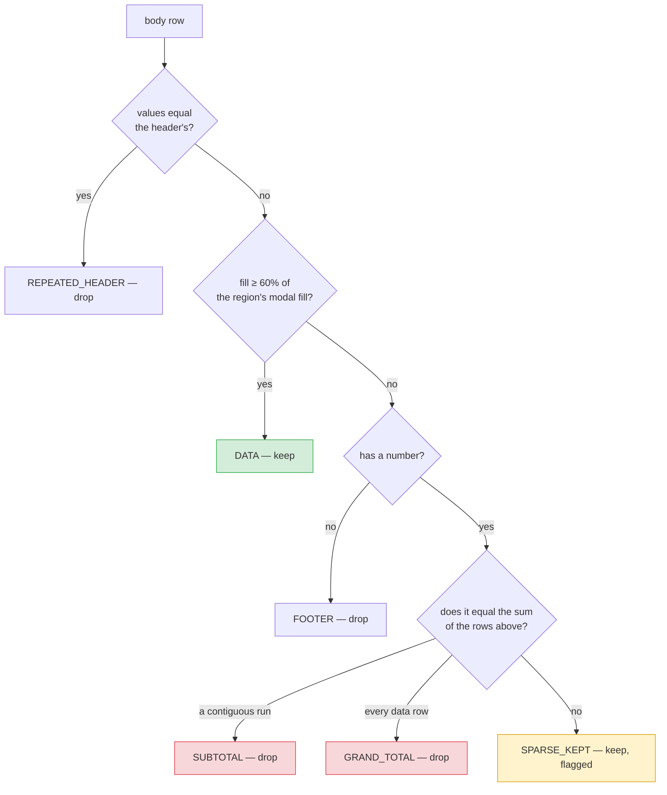
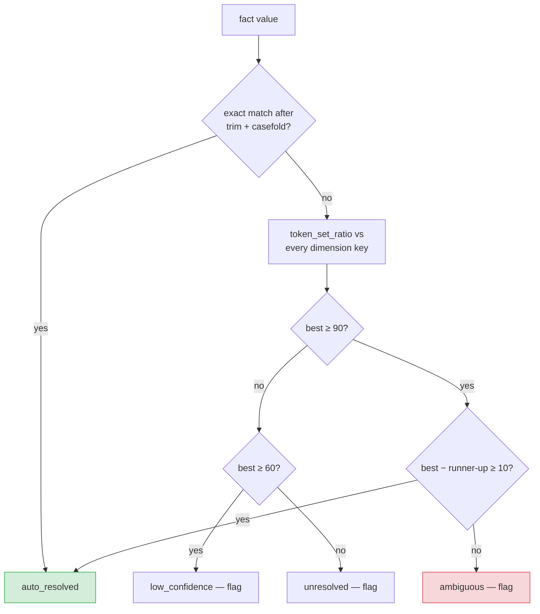

# Architecture — AHI Schema-Free Cleaning Pipeline

Technical reference for the pipeline that converts report-shaped Excel exports into
table-ready CSVs.

**Design principle: no schema, no aliases, no keyword lists.** Every structural decision
is derived from the data's own shape, types, distinctness, density and arithmetic. The
pipeline has no idea what a "premium" is and does not need one. Column names in the output
are the file's own labels, normalized.

This is verified, not asserted — see [§12 Ablation](#12-ablation-what-is-actually-load-bearing).

---

## 1. System overview



`signals.py` sits underneath all of it: the scoring primitives every detector is built
from. Nothing in the tree consults a field name.

| Module | Responsibility |
|---|---|
| `signals.py` | Scoring primitives: fill density, uniqueness, type profile, contrast, emphasis |
| `typing_utils.py` | Fine-grained type inference and homogeneity |
| `reader.py` | Workbook → cell grid; nulls error cells; captures bold/fill/border |
| `geometry.py` | Sheet → table **regions**; all blank-gap handling |
| `header.py` | Composite header scoring, the no-header path, column naming |
| `rowclass.py` | Sparsity + arithmetic row classification |
| `extract.py` | Sequences the above per region; types; validates |
| `orchestrate.py` | Table roles, stack/join relationships |
| `join.py` | Value-based key discovery, fuzzy resolution with a margin rule |
| `audit.py` | Every decision, with its score and its reason |

---

## 2. Regions: a sheet is not one table



**The governing rule: gap size is never an input to any decision.** One blank row and
twelve blank rows are treated identically. What decides is whether what sits on the other
side of the gap looks like the same table.

| Direction | Question | Signal |
|---|---|---|
| Rows | same table across the gap? | column **type profile** match ≥ 70% |
| Columns | gutter, or two tables? | **row extent** overlap ≥ 75% |

Interior blank rows are removed from the region; each surviving row keeps its original
sheet index in `source_rows`, so the audit report still points at the right line.

Two guards stop decoration becoming a table: a run whose modal fill is 1 is attached to
the preceding region rather than promoted, and any region whose modal fill stays below 2
is discarded outright — a stack of single-cell title lines has no second column, so there
is nothing to tabulate.

---

## 3. Orientation

```
score(upright)    = mean type-homogeneity of columns + uniqueness of row 1
score(transposed) = mean type-homogeneity of rows    + uniqueness of column 1
```

In an upright table each *column* holds one type while each row is mixed; a transposed
table reverses this. And a header line's labels are distinct, while a line of records
repeats values — File4's row 1 says `South Zone PC` four times (0.45) while its column 1
is fully distinct (1.00).

Homogeneity is computed on the **fine type lattice** — `empty · bool · int · float · date ·
datetime · date_string · id_string · text`. This matters: under a coarse `{str, num, date}`
classification, business data is mostly strings and both axes look homogeneous. Separating
`POL-1000001` (`id_string`) from `Rotterdam` (`text`) from `2026-07-01` (`date_string`)
restores the contrast the score depends on.

**When the margin is under 0.3** the content signals are too close to call, and the shape
decides: tables are far more often taller than wide, so the reading that yields more
records than fields wins. The region is flagged `confident: false`.

Measured floor: an 8-column table reads upright confidently from **2 data rows onward**
(margin 0.31 at n=2, rising to 0.44 at n=8). Below that the shape is genuinely ambiguous.

---

## 4. Header detection

Five content signals, weighted to sum to 1.0, plus formatting as a bonus:

| Signal | Weight | What it captures |
|---|---|---|
| contrast | 0.30 | header cell type ≠ the modal type of the column below |
| textness | 0.25 | labels are text even above numeric columns |
| uniqueness | 0.20 | labels do not repeat |
| fill ratio | 0.15 | populated cells vs. the block's modal fill |
| brevity | 0.10 | labels are short |
| *emphasis* | *+0.15 bonus* | bold, fill or border the data rows lack |

Emphasis is a **bonus, never a component**, because the AHI sample files carry no
formatting at all — their header rows are not bold. A file with no styling is still fully
scored by the five content signals.

Blank cells are excluded from every denominator, which is why a header with a hole in it
(File1's spans B2:J2 with F2 empty) is not penalised for the gap.

### Refusing to invent a header

Below a score of **0.55** the region is declared headerless: columns become
`column_1..column_n` and `header_detected: false` goes into the report. Naming a data row
as the header is a worse failure than admitting none was found.

```
clean header                 0.93  detected
header with blank cells      0.78  detected
header with "" cells         0.78  detected
header with duplicate labels 0.88  detected
header row entirely blank    0.51  REFUSED
no header at all             0.51  REFUSED
```

> The 0.51 vs 0.55 margin is thin — 0.04. Emphasis widens it when a file has styling;
> these files do not. Treat a borderline score as needing review.

### Naming

| Case | Result |
|---|---|
| normal label | casefold, non-alphanumerics → `_`, trimmed |
| `None` / `""` / whitespace, column has data | `column_<n>` — **column kept** |
| `None`, column also entirely empty | dropped as a gutter |
| duplicate after normalizing | `name`, `name_2`, `name_3` |
| numeric label (`2024`) | `col_2024` — never a bare-digit name |
| label normalizing to nothing (`"---"`) | `column_<n>` |

A blank header over a populated column **never** drops the column. Gutter removal requires
the header *and* every data cell to be empty, checked together after the header is known.

**Two-row headers** are merged when the second row also scores ≥0.55 **and** contrasts
≥0.5 with the data below it. The contrast gate is essential: in a mostly-text table an
ordinary data row scores ~0.55 on uniqueness and fill alone, and without it the pipeline
swallows the first record of every such file.

---

## 5. Row classification



**Sparsity finds candidates; arithmetic confirms them.** A total row is one whose number
equals the sum of the rows above it — language-independent, and immune to a profit centre
legitimately named `Total Risk PC` (that row is not sparse and its numbers do not sum).

Totals resolve in two passes so nesting works. Subtotals settle first against the
contiguous data run directly above; only then are survivors tested as grand totals, against
every data row above *and* against the confirmed subtotals. Scope separates the two labels:
a run covering every data row is a grand total, a proper subset is a subtotal.

**Text patterns exist only as corroboration.** They add a clause to the audit reason and
never decide anything — proven in §12, where deleting every regex changes no output.

**The conflict rule: a sparse row that fails the arithmetic check is kept, flagged with
confidence 0.5, never dropped.** A record with several empty fields is ordinary in real
data, and silently losing one is the worst failure this module could have.

---

## 6. Types, without a schema to declare them

Each column becomes whatever the majority of its own values already are. Two structural
safeguards stop identifiers being damaged:

- **leading zero** → keep as text. Meaningless in a quantity; only survives if already text.
- **near-unique integers all of one digit width** → keep as text. Account numbers, centre
  codes, branch ids. A measure varies in magnitude; a code does not.

The second rule recovers, from the data alone, what the old schema declared: `1005` in
File1 and `PC0001` in File5 both land as `id_string`, so the same field is text in both
files with nothing telling the pipeline they are the same field.

A float column whose every value is whole is written as `Int64`, so a ZIP does not land in
the CSV as `75202.0`.

### What is genuinely lost

`08085` cannot be recovered. The source cell holds the *number* 8085 — Excel destroyed the
leading zero before the pipeline ever saw it, and the column's widths are mixed so the
code heuristic correctly declines to fire. The old schema knew this column was a ZIP; no
algorithm can.

More broadly: **semantic unification across sources is out of scope by construction.**
Deciding that `Producer` in one file and `Agent Name` in another belong in one target
column requires a schema, a config, an LLM or a human. The pipeline emits per-file-correct
structure and records every inferred type; mapping is a deliberate downstream step.

---

## 7. Table roles and relationships

| Decision | Signal |
|---|---|
| **FACT** | has continuous measures alongside a key or a date column |
| **DIMENSION** | small, one unique entity per row, no continuous measures |
| **STACK** | ≥90% matching column names, **or** identical width with ≥90% matching type profile |
| **JOIN** | one FACT + one DIMENSION with a discoverable value-based key |

A **measure** is a numeric column that is fractional or that repeats. Distinctness alone
cannot separate a premium from a ZIP — both are unique. Fractionality can. (Limit: an
integer measure that never repeats reads as a code; this affects role classification only,
never the row data.)

Sheet names are recorded as `name_hint` and never decide. A tab called `Producer Lookup`
holding transactional rows is a FACT.

Stacking by **type profile** is the fallback for sheets holding the same data under
different labels; it is flagged `confidence: low` so a reviewer knows names did not agree.

`source_sheet` is inserted on stacked output because nothing in the rows identifies the
period — File5's Jan and Feb reuse the same policy numbers, and without it the stacked rows
are indistinguishable and read as duplicates. For the same reason uniqueness checks are
scoped **within a region**, before stacking.

---

## 8. Join key discovery and the margin rule

Keys are found from **values, never header names** — and this is now load-bearing rather
than merely principled: without a schema the two columns are literally called
`producer_agencyname` and `producer`, and no name matching would pair them.

Two passes, for cost. Normalized exact set-overlap across all column pairs first (settles
File6 at 0.8 outright); fuzzy scoring, which is quadratic, only runs on what is left, and
only against dimension columns distinct enough to be a key.



`token_set_ratio` returns 100 whenever one side's tokens are a subset of the other's, so a
generic value clears any absolute threshold against several candidates at once:

```
'MJC '         → MJC Agency Group=100 , Metro Agency Group= 10   margin 90  ✓ resolve
'Agency Group' → Metro Agency Group=100, MJC Agency Group=100    margin  0  ✗ flag
'Brown & Brown'→ Apex Insurance Brokers=34                       below 60  ✗ flag
```

**Joins are always `how='left'`.** A fact row never disappears because its lookup missed.

---

## 9. Audit trail

One JSON per workbook, keyed by table region rather than by sheet:

```
{
  "source_file", "generated_at", "embedded_images",
  "tables": [ {
      "region", "regions_on_sheet", "region_origin": {row, column, how},
      "orientation": { row_score, column_score, margin, confident, orientation },
      "header":      { row_index, detected, score, multi_row, scores[] },
      "column_names", "inferred_types",
      "dropped_rows": [ { sheet_row, classification, reason, content } ],
      "coercion_failures", "validation", "notes"
  } ],
  "workbook": { "table_roles", "relationships", "join" },
  "outputs", "summary", "needs_human_review"
}
```

`summary` carries the three fields a reviewer should check first:
`headerless_tables`, `low_confidence_orientations`, `join_values_needing_review`.

**Every dropped row carries a `reason` naming the evidence** — `"column 2 equals the sum of
the 3 data rows above"`, not `"matched subtotal pattern"`.

---

## 10. Scenario coverage

| # | Scenario | Handled by | Verified |
|---|---|---|---|
| 1–2 | 1 / n blank rows mid-table (1,2,3,5,12) | §2 profile match | `test_geometry` |
| 3 | Blank rows then a different table | §2 profile mismatch | `test_geometry` |
| 4 | Blank rows then a footer | §2 modal-fill-1 rule | `test_geometry` |
| 5 | Leading / trailing blank rows | §2 | `test_geometry` |
| 6–7 | 1 / n empty columns mid-table (1,2,3,4,7) | §2 row extent | `test_geometry` |
| 8 | Empty columns splitting two tables | §2 extent mismatch | `test_geometry` |
| 9 | Leading / trailing empty columns | §2 | `test_geometry` |
| 10 | Multi-line banner block fenced by blanks | §2 modal fill < 2 | `test_geometry` |
| 11 | Column with data, **blank header** | §4 → `column_n`, kept | `test_header` |
| 12 | Header with `None` cells | §4 blanks excluded | `test_header` |
| 13 | Header with `""` cells | reader trims → as 12 | `test_header` |
| 14 | Header with duplicate labels | §4 suffixing | `test_header` |
| 15 | Header row entirely blank | §4 → headerless | `test_header` |
| 16 | No header at all | §4 → headerless | `test_header` |
| 17 | Header below banners | §4 band scan | `test_header`, File2 |
| 18 | Two-row header | §4 + contrast gate | `test_header` |
| 19 | Repeated header mid-body | §5 | `test_rowclass` |
| 20 | Numeric headers (`2024`) | §4 → `col_2024` | `test_header` |
| 21 | Merged cells in header | reader forward-fill | File2 |
| 22 | Transposed layout | §3 | File4 |
| 23 | Subtotals mid-table | §5 arithmetic | File3 |
| 24 | Grand total at bottom | §5 arithmetic | File2 |
| 25 | Nested subtotals + grand total | §5 two-pass | `test_rowclass` |
| 26 | Banner / logo / footer lines | §5 sparsity | File2 |
| 27 | Non-English footers and totals | §5 — no keywords | `test_rowclass`, §11 |
| 28 | Sparse but genuine record | §5 conflict rule | `test_rowclass` |
| 29 | Excel error cells | reader nulls `data_type=='e'` | File2 |
| 30 | Dates as text vs datetime | §6 per-column inference | File1/File5 |
| 31 | Identifier vs quantity | §6 code heuristic | File1/File5 |
| 32 | Two tables side by side | §2 | `test_geometry` |
| 33 | Dirty join keys | §8 margin rule | File6 |

118 tests. `python -m pytest`.

---

## 11. Acceptance: an unseen schema

The six sample files cannot demonstrate schema-independence — the pipeline was built while
looking at them. The real check is a file it has never seen, combining every structural
nasty at once: unknown column names, a title banner, a gutter column, a 3-row gap
mid-table, a subtotal, a grand total, and a **German** footer.

```
columns : consignment_ref, origin_depot, gross_weight_kg, despatch_date, handling_fee
rows    : 5            header: row 0, detected, 0.94      orientation: normal, confident
types   : id_string, text, float, date_string, float
dropped : SUBTOTAL     Subtotal | 3723.25       <- column 2 equals the sum of the 3 rows above
          GRAND_TOTAL  Grand Total | 6493.5     <- column 2 equals the sum of all 5 rows above
          FOOTER       *** Ende des Berichts *** <- single populated cell, no numbers
reconciles: True
```

The German footer was dropped on structure alone, with no text match. That is the whole
design working.

---

## 12. Ablation: what is actually load-bearing

Each signal disabled in turn, against the six files' known row counts:

| Ablation | Result |
|---|---|
| baseline | PASS |
| no type-contrast in header scoring | PASS |
| no uniqueness in header scoring | PASS |
| **no text patterns at all** | **PASS** |
| no arithmetic total check | BREAKS — File2 11≠10, File3 13≠10 |
| no sparsity check | BREAKS — File2 11≠10, File3 13≠10 |
| no orientation detection | BREAKS — File4 3≠10 |

Two conclusions:

1. **Deleting every regex in the codebase changes no output.** The keyword patterns are
   genuinely corroboration, not mechanism. This is the claim that matters, and it is
   measured rather than argued.
2. Header scoring is *redundant* — knock out contrast or uniqueness individually and the
   remaining signals still carry it. Sparsity, arithmetic and orientation are the three
   things that actually do work.

---

## 13. Known limits

| Limit | Consequence |
|---|---|
| Semantic mapping is out of scope | Unifying `Producer` and `Agent Name` into one target column needs a schema, config, LLM or human. The pipeline stops at per-file-correct structure. |
| Leading zeros already lost in the source | `08085` stored as the number 8085 is unrecoverable. |
| Orientation needs ≥2 data rows | A 1-row table is genuinely ambiguous and is flagged `confident: false`. |
| Near-square tables are the weak case | File6's 5×4 lookup decides on the shape tiebreak, not content. Flagged. |
| Integer measures that never repeat read as codes | Affects role classification only, never row data. |
| Headers beyond two rows | Merged to two; deeper hierarchies are flagged, not guessed. |
| Stacking compares adjacent fact tables pairwise | A workbook mixing two different stackable groups ships them standalone. |
| One fact + one dimension per workbook | Multiple lookups are not chained — deliberate, beyond POC scope. |
