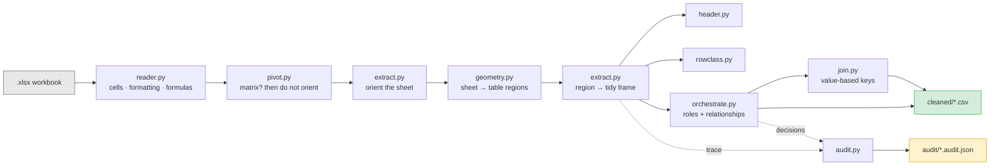
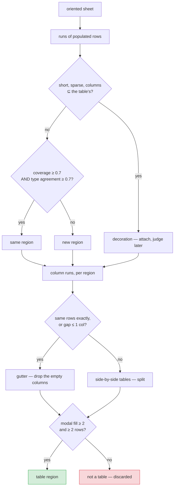
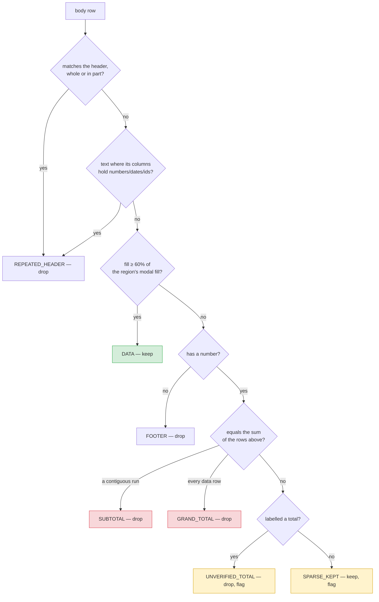
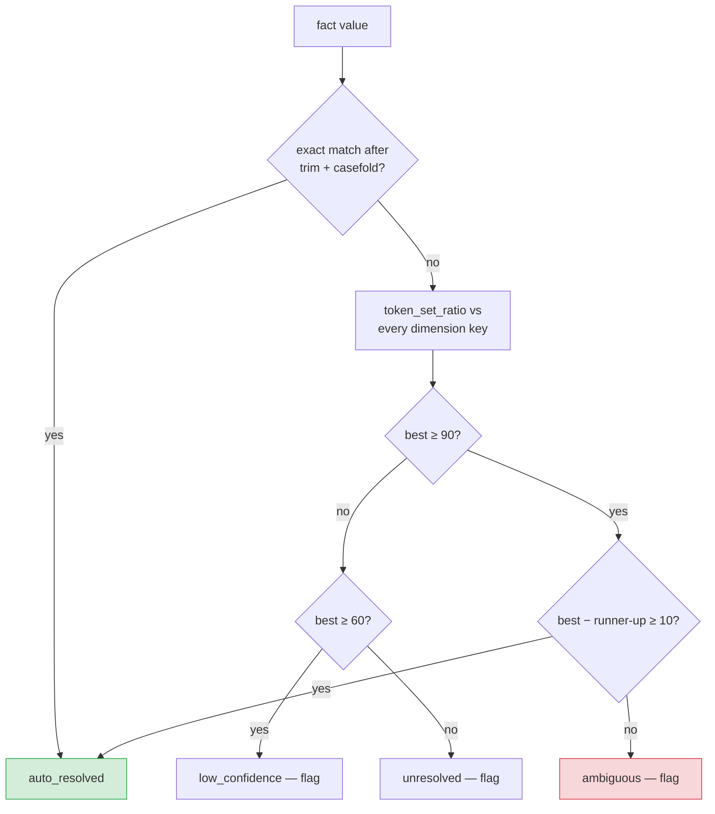

# Architecture — AHI Schema-Free Cleaning Pipeline

Technical reference for the pipeline that converts report-shaped Excel exports into
table-ready CSVs.

**Design principle: no schema, no aliases, no field names.** Every structural decision is
derived from the data's own shape, types, distinctness, density and arithmetic. The
pipeline has no idea what a "premium" is and does not need one. Output columns are the
file's own labels, normalized.

Measured against the labelled scenario corpus: **every workbook produces the correct
records.** A few carry an advisory — the pipeline reporting honest uncertainty, not an
error.

```bash
python tools/scorecard.py
```

For the same decisions explained without the machinery, see
[BUSINESS_GUIDE.md](BUSINESS_GUIDE.md).

---

## 1. System overview



`signals.py` sits underneath all of it: the scoring primitives every detector is built
from. Nothing in the tree consults a field name.

| Module | Responsibility |
|---|---|
| `signals.py` | Fill density, uniqueness, type profile, coverage, contrast, emphasis, merged-banner |
| `typing_utils.py` | Fine-grained type inference and homogeneity |
| `reader.py` | Workbook → cell grid; nulls error cells; captures formatting and formulas |
| `geometry.py` | Sheet → table **regions**; all blank-gap handling |
| `header.py` | Composite header scoring, the no-header path, column naming |
| `rowclass.py` | Sparsity + arithmetic row classification |
| `pivot.py` | Wide-matrix detection and the melt back to long form |
| `extract.py` | Sheet orientation, region sequencing, gutter realignment, types, validation |
| `orchestrate.py` | Table roles, stack/join relationships |
| `join.py` | Value-based key discovery, fuzzy resolution with a margin rule |
| `audit.py` | Every decision, with its score and its reason |

**Ordering is load-bearing in four places.** A pivot is recognised *before* orientation,
because a matrix reads consistently both ways and the tiebreak would stand it on its side.
Orientation is decided for the whole sheet *before* segmentation, because in a sideways
sheet a blank row is a blank field, not a table separator. A merged banner is stripped
*before* orientation is scored, because a value repeated across every column makes its row
perfectly type-homogeneous and drags the sheet towards looking transposed. And gutter
columns are dropped *after* the header is located, because "empty" can only be judged
against both.

---

## 2. Sheet orientation

```
score(upright)    = mean type-homogeneity of columns + uniqueness of row 1
score(transposed) = mean type-homogeneity of rows    + uniqueness of column 1
```

In an upright table each *column* holds one type while each row is mixed; a transposed
table reverses this. And a header line's labels are distinct, while a line of records
repeats values.

Homogeneity is computed on a **fine type lattice** — `empty · bool · int · float · date ·
datetime · date_string · id_string · text`. Under a coarse `{str, num, date}`
classification business data is mostly strings and both axes look homogeneous; separating
`POL-1000001` (`id_string`) from `Rotterdam` (`text`) from `2026-07-01` (`date_string`)
restores the contrast the score depends on.

Only a **decisive** verdict flips the whole sheet. A marginal one is left alone and
settled per region, where a small lookup table can still be judged on its own.

**Per-region, when the margin is under 0.3**, shape decides: a table is far more often
taller than wide, so the reading yielding more records than fields wins, and the region is
flagged `confident: false`. Header quality was tried here as a stronger tiebreak and
**measured worse** — on a small lookup the first column of entity names scores as well as
the real header, and the block flips into a single row. It was reverted.

### Pivots are not an orientation problem

A wide matrix spreads one measure across the page, with column headings that are *values*
of a field rather than fields themselves:

```
Producer                 | Jan-2026  | Feb-2026  | Mar-2026
Pinnacle Agency Partners | 12,299.66 | 35,117.88 | 32,440.79
```

It is genuinely symmetric — every row homogeneous and every column too — so the orientation
vote ties and the shape tiebreak flips it. Recognition therefore has to come first, and at
**both** gates: the sheet-level flip and the per-region one. Fixing only the first leaves
the region-level vote to transpose it independently.

Detection needs three things together, and an ordinary table fails at least one:

| Condition | Why it is needed |
|---|---|
| a trailing run of ≥3 same-typed, all-distinct headings | the axis of the matrix |
| the cells beneath are one numeric measure, ≥90% filled | a grid, not a mixed table |
| the remaining columns identify each row uniquely | one row per entity |

`Jan-2026` is not a date by the type lattice's reckoning — it reads as an identifier — so
the axis is recognised by *behaviour* (same type, all distinct) rather than by type name.
That alone is far too loose, which is why it is only ever accepted alongside the two guards.
Measured on the corpus: exactly one file unpivots, and no ordinary table is touched.

The melt produces one row per cell, and the melted key carries the sheet's own labels
(`Jan-2026`), not the SQL-safe column names — those labels are data now, not identifiers.
The key column is named `period` when the headings resolve to points in time and `category`
otherwise, inferred from the values themselves.

---

## 3. Regions: a sheet is not one table



**Gap size is never an input for rows.** One blank row and twelve are treated identically;
what decides is whether what sits on the other side looks like the same table.

Two questions, both of which must be answered yes:

| Question | Signal | Catches |
|---|---|---|
| Do the runs use the same columns? | **coverage** — Jaccard of populated positions | a one-column banner that would otherwise "match" on its single column |
| Do those columns hold the same kinds of value? | **type agreement** over commonly-populated positions | a genuinely different table below |

A position empty on *either* side is skipped rather than counted as a mismatch: an absent
value is not contrary evidence, and counting silence as disagreement splits a table at a
row that merely has a gap in it. Coverage is what makes that safe.

**A run's first row is excluded from its own profile.** It is very often a header, and its
all-text signature would otherwise dominate a short run — a two-row run of header plus one
record profiles as pure text and then matches nothing.

**A short, sparse run whose columns are a subset of the table's is decoration**, not a new
table. Attaching it keeps it out of the region list and, just as importantly, stops a
subtotal row acting as a wall that cuts one table in two. Length is what separates it from
a genuinely narrower table below: an adjustment table brings its own header and several
rows; decoration does not.

**For columns, extent decides.** Two runs covering exactly the same rows are one table
with a decorative gutter. A wider gap between blocks of differing length is two tables
placed side by side — they almost always differ in length, and that difference is the one
honest signal that they are unrelated.

---

## 4. Header detection

Five content signals, weighted to sum to 1.0, plus formatting as a bonus:

| Signal | Weight | What it captures |
|---|---|---|
| contrast | 0.30 | header cell type ≠ the modal type of the column below |
| textness | 0.25 | labels are text even above numeric columns |
| uniqueness | 0.20 | labels do not repeat |
| fill ratio | 0.15 | populated cells vs. the block's modal fill |
| brevity | 0.10 | labels are short |
| *emphasis* | *+0.15 bonus* | bold, fill or border the data rows lack |

Emphasis is a **bonus, never a component** — several corpus files carry no formatting at
all, and a file with no styling must still be fully scored by the five content signals.

Blank cells are excluded from every denominator, which is why a header with a hole in it
is not penalised for the gap.

### Refusing to invent a header

Below **0.55** the region is declared headerless: columns become `column_1..column_n` and
`header_detected: false` goes into the report. Naming a data row as the header is a worse
failure than admitting none was found.

### Naming

| Case | Result |
|---|---|
| normal label | casefold, non-alphanumerics → `_`, trimmed |
| `None` / `""` / whitespace, column has data | `column_<n>` — **column kept** |
| `None`, column also entirely empty | dropped as a gutter |
| duplicate after normalizing | `name`, `name_2`, `name_3` |
| numeric label (`2024`) | `col_2024` — never a bare-digit name |
| label normalizing to nothing (`"---"`) | `column_<n>` |

**Two-row headers** are merged when the second row scores ≥0.55 **and** contrasts ≥0.5
with the data below it. The contrast gate is essential: in a mostly-text table an ordinary
record scores ~0.55 on uniqueness and fill alone, and without it the pipeline swallows the
first record of every such file.

### Header / body realignment

Some exports put the decorative gap in the data rows but not in the header, so the header
occupies columns 0–7 while every record occupies 0,1,2,4,5,6,8,9. Read positionally, every
value after the first gap lands under the wrong label — the carrier name arrives in the
premium column and **nothing announces the error**.

When both sides hold the same *number* of values, the disagreement is only about spacing:
each side is compacted and the two are zipped back together, with a note in the audit
naming both column sets. When the counts differ the shapes genuinely differ and nothing is
moved — guessing there would be worse than the gap.

---

## 5. Row classification



**Sparsity finds candidates; arithmetic confirms them.** A total row is one whose number
equals the sum of the rows above it — language-independent, and immune to a profit centre
legitimately named `Total Risk PC` (that row is not sparse and its numbers do not sum).

Totals resolve in two passes so nesting works. Subtotals settle first against the
contiguous data run directly above; only then are survivors tested as grand totals, against
every data row above *and* against the confirmed subtotals. Scope separates the two labels:
a run covering every data row is a grand total, a proper subset is a subtotal. A section of
one record still has a subtotal, so a run of one counts — the candidate must already be
sparse to reach the arithmetic at all.

### Repeated headers, three ways

A header can reappear in the body in three forms, and only the first is catchable by
comparing labels:

1. **verbatim** — every populated value matches the header
2. **in part** — `Policy Summary | | | | Premium | PolicyNumber`, a fragment echoing the
   header's own labels at the same positions
3. **restated** — `PC Number` for `ProfitCenterNumber`. No label matches. It is caught the
   same way the header itself was found: it is text where the column beneath it is
   numeric, dated or an identifier.

### The two rules that keep this safe

**A sparse row that fails the arithmetic and carries no total-ish wording is kept**, with
confidence 0.5 and a flag. A record with several empty fields is ordinary in real data, and
silently losing one is the worst failure this module could have.

**Wording alone can never drop a row.** The row must be sparse on structure first; the
wording only decides *which kind* of non-record it is.

### The one deliberate concession

`UNVERIFIED_TOTAL` is a judgement call, made explicitly. Real reports carry totals whose
figures are stale, hand-edited or rounded — the corpus has `TOTAL West Zone PC = 48387.01`
against rows summing to 48383.11, and `Grand Total = 999999.99`. Keeping those as data
corrupts every downstream sum. They are dropped, but into **their own class, flagged for
review**, never conflated with a total the arithmetic actually proved.

The cost is measured and stated in §9: text patterns are now load-bearing for three of the
42 files. That is the price of this decision, not an oversight.

---

## 6. Types, without a schema to declare them

Each column becomes whatever the majority of its own values already are, with three
structural safeguards:

- **leading zero** → keep as text. Meaningless in a quantity; only survives if already text.
- **near-unique integers all of one digit width** → keep as text. Account numbers, centre
  codes, branch ids. A measure varies in magnitude; a code does not.
- **most values parse as dates** → a date column. A column written in four different date
  formats has no single lexical signature, so the type lattice sees only "text".
  Parseability is the honest test, and the stragglers become reportable failures rather
  than the column's true nature.

A float column whose every value is whole is written as `Int64`, so a ZIP does not land in
the CSV as `75202.0`.

**Formula cells are detected on a second read.** `data_only` gives the value Excel cached
when it last saved; a workbook written by a library and never opened in Excel has no cache,
so a formula-driven column arrives silently empty. Knowing which cells hold formulas is the
difference between reporting that and shipping a column of nulls as if the source were
blank.

### What is genuinely lost

A leading zero already destroyed in the source is unrecoverable. And **semantic unification
across sources is out of scope by construction**: deciding that `Producer` in one file and
`Agent Name` in another belong in one target column requires a schema, a config, an LLM or
a human. The pipeline stops at per-file-correct structure and records every inferred type.

---

## 7. Table roles and relationships

| Decision | Signal |
|---|---|
| **FACT** | continuous measures alongside a key or a date column |
| **DIMENSION** | small, one unique entity per row, no continuous measures |
| **STACK** | ≥90% matching column names, **or** identical width with ≥90% matching type profile |
| **JOIN** | one FACT + one DIMENSION with a discoverable value-based key |

A **measure** is a numeric column that is fractional, or repeats, **or goes negative**.
Distinctness alone cannot separate a premium from a ZIP — both are unique. A negative value
settles it on its own: identifiers, codes and ZIPs are never negative, which is what stops
an adjustment table of whole, all-distinct amounts from being mistaken for a lookup.

Sheet names are recorded as `name_hint` and never decide. A tab called `Producer Lookup`
holding transactional rows is a FACT. Position does not decide either — a lookup above the
fact table is still a lookup.

### Continuation sheets

A report split across sheets often carries the header only on the first. The continuation
sheet is genuinely headerless, and the extractor is right to say so — promoting a data row
would be worse. The **workbook** is the level that can see the answer: another table with
the same width and the same per-column types, which does have a header.

That sheet's names are adopted, matched on shape and type rather than on position or sheet
name, so a continuation is recognised whether it comes before or after the sheet it belongs
to. The adoption is recorded in the audit, naming the donor.

Uniqueness checks are scoped **within a region**, and a key column is nominated by *shape*
rather than distinctness: the thing being looked for is a duplicate, so requiring a high
distinct ratio would mean a column stops counting as a key exactly when it has the problem
worth reporting.

---

## 8. Join key discovery and the margin rule

Keys are found from **values, never header names** — load-bearing rather than merely
principled: without a schema the two columns are literally called `producer_agencyname`
and `producer`, and no name matching would pair them.

Two passes, for cost. Normalized exact set-overlap across all column pairs first; fuzzy
scoring, which is quadratic, only runs on what is left, and only against dimension columns
distinct enough to be a key.



`token_set_ratio` returns 100 whenever one side's tokens are a subset of the other's, so a
generic value clears any absolute threshold against several candidates at once:

```
'MJC '         → MJC Agency Group=100 , Metro Agency Group= 10   margin 90  ✓ resolve
'Agency Group' → Metro Agency Group=100, MJC Agency Group=100    margin  0  ✗ flag
'Brown & Brown'→ Apex Insurance Brokers=34                       below 60  ✗ flag
```

**Joins are always `how='left'`.** A fact row never disappears because its lookup missed.

---

## 9. Ablation: what is actually load-bearing

Each signal disabled in turn and the whole corpus re-scored. On the current 18-workbook
set:

| Ablation | Result |
|---|---|
| baseline (all signals) | PASS |
| no uniqueness in header | PASS |
| no arithmetic total check | PASS |
| no restated-header detection | PASS |
| no sheet-level orientation | PASS |
| no region profile matching | PASS |
| no header/body realignment | PASS |
| no type-contrast in header | BREAKS 1 (14) |
| no merged-banner detection | BREAKS 1 (18) |
| no pivot detection | BREAKS 1 (01) |
| no header adoption | BREAKS 1 (14) |
| no sparsity check | BREAKS 2 (16, 18) |
| **no text patterns at all** | **BREAKS 2 (16, 18)** |

**A PASS here means "no workbook in the current corpus depends on this", not "this signal
is useless".** An earlier 42-workbook corpus broke on region profile matching (5 files),
sheet-level orientation (2), header/body realignment (1) and restated-header detection (2).
Those scenarios are simply absent from the present set. Ablation measures the corpus as
much as the code, and reading it otherwise would justify deleting signals that are the only
thing standing between a past failure and a repeat of it.

Two results worth reading carefully either way:

1. **Text patterns are load-bearing.** In an earlier version deleting every regex changed
   nothing. That is no longer true, and the cause is the `UNVERIFIED_TOTAL` decision in §5
   — a deliberate trade, not a regression. Wording still cannot drop a row on its own; it
   only classifies a row that structure already found suspect.
2. **The arithmetic check no longer changes any record count** — the text path now catches
   the same rows. It still earns its place: it is what separates a *proven* total from an
   unverified one, and that distinction is the whole value of the audit report.

### The scorecard has been wrong three times

Each time an ablation "passed" because the harness could not see the damage. A benchmark
that cannot fail is not measuring anything, so each gap is now closed with a direct check
in `tools/scorecard.py`:

| What was missed | The check now |
|---|---|
| A transposed table split in half — only one half carried the policy numbers | A sideways sheet holds exactly one table, so more than one transposed region is a split |
| Two real columns emptied by misalignment, excused by an over-broad "explained empty column" rule | Only a formula with no cached result excuses an empty column; anything else with no realignment reported is a defect |
| A pivot matrix mangled, scored `0 == 0` because the file has no policy numbers | An absent oracle is reported as an absent oracle, and a melt is checked for conservation: one row per value cell, nothing lost or invented |

---

## 10. Testing

Two kinds of test, deliberately separated, because the sample corpus is expected to change
and has been swapped three times during development.

| Suite | Scope | Stability |
|---|---|---|
| `test_scenarios.py` | Every workbook currently in `sample_files_uncleaned/` | Parametrized over whatever is present; new files are picked up with nothing to register, and no assertion pins a file count |
| everything else | Header, geometry, row classification, types, joins, orchestration, pivots | Sheets built **in memory**; never names a corpus file, so swapping the samples cannot break them |

That split is itself a fix. Behaviour tests originally named corpus files, and each corpus
swap broke a chunk of the suite for reasons that had nothing to do with the code.

**The oracle.** Every genuine record in the corpus carries a `POL-nnnnnn` policy number;
banners, totals, footers and repeated headers do not. Counting those tokens in the raw grid
gives an expected record count that owes nothing to the code being tested. For a pivot,
which has no such tokens, conservation is the oracle instead — unfolding must produce
exactly one row per value cell.

**Defects versus advisories.** An advisory means the output is right and the pipeline is
reporting that it was not certain — an orientation decided by shape, a column named
positionally because its header cell was blank. Those are a feature, and counting them as
failures would push the design towards false confidence.

169 tests. `python -m pytest`.

---

## 11. Known limits

| Limit | Consequence |
|---|---|
| Semantic mapping is out of scope | Unifying `Producer` and `Agent Name` into one target column needs a schema, config, LLM or human. |
| Leading zeros already lost in the source | A ZIP stored as the number 8085 is unrecoverable. |
| Orientation needs ≥2 data rows | A 1-row table is genuinely ambiguous; flagged `confident: false`. |
| Near-square tables | Decided by shape, not content. Correct on this corpus, always flagged. |
| Integer measures that never repeat | Read as codes unless negative. Affects role classification only, never row data. |
| Headers beyond two rows | Merged to two; deeper hierarchies flagged, not guessed. |
| Wide gutters inside one table | A gap ≥2 columns is read as a table boundary unless both sides span exactly the same rows. |
| One fact + one dimension per workbook | Multiple lookups are not chained — deliberate, beyond POC scope. |
| Pivot detection needs ≥3 value columns | A two-month matrix is indistinguishable from an ordinary table with two numeric columns. |
| Header adoption needs an exact width match | A continuation sheet missing a column keeps positional names rather than guessing an alignment. |
