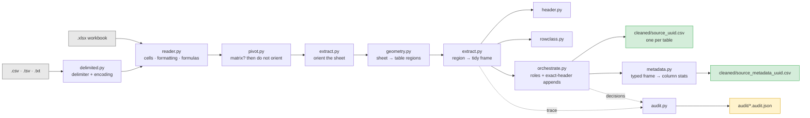
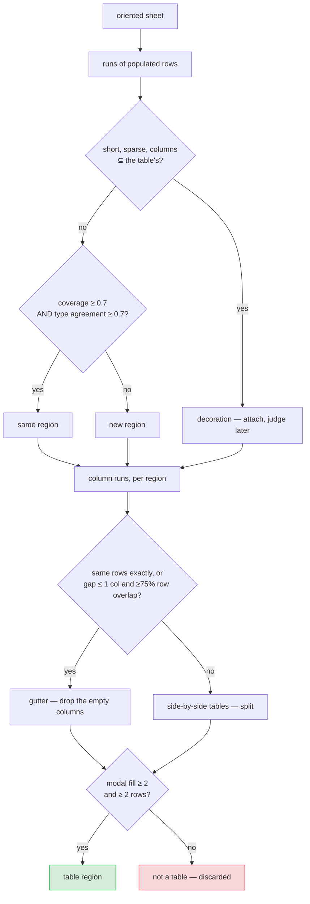
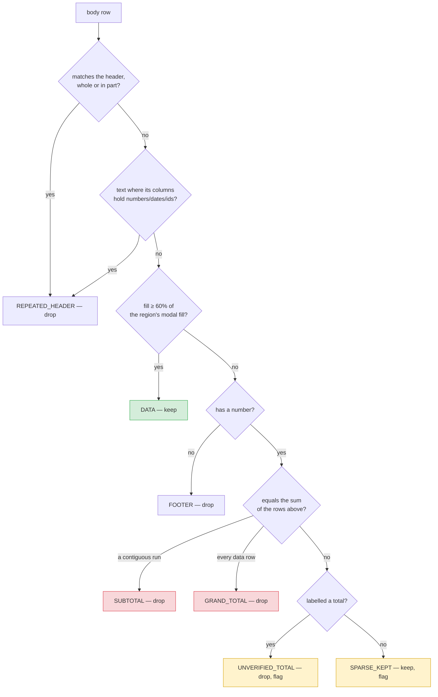

# Architecture — AHI Schema-Free Cleaning Pipeline

Technical reference for the pipeline that converts report-shaped Excel exports and
delimited text files into table-ready CSVs, each with a per-column metadata summary.

Built on **polars**. Measured: **1,000,000 rows in 93 seconds** on a single sheet.

**Design principle: no schema, no aliases, no field names.** Every structural decision is
derived from the data's own shape, types, distinctness, density and arithmetic. The
pipeline has no idea what a "premium" is and does not need one. Output columns are the
file's own labels, normalized.

Measured against the labelled scenario corpus: **every workbook produces the correct
records.** A few carry an advisory — the pipeline reporting honest uncertainty, not an
error.

```bash
python backend/tools/scorecard.py
```

For the same decisions explained without the machinery, see
[BUSINESS_GUIDE.md](BUSINESS_GUIDE.md).

---

## 1. System overview



`signals.py` sits underneath all of it: the scoring primitives every detector is built
from. Nothing in the tree consults a field name.

| Module | Responsibility |
|---|---|
| `signals.py` | Fill density, uniqueness, type profile, coverage, contrast, emphasis, merged-banner |
| `typing_utils.py` | Fine-grained type inference and homogeneity |
| `reader.py` | Workbook → cell grid; nulls error cells; captures formatting and formulas |
| `delimited.py` | CSV/TSV → the same grid; sniffs delimiter and encoding |
| `geometry.py` | Sheet → table **regions**; all blank-gap handling |
| `header.py` | Composite header scoring, the no-header path, column naming |
| `rowclass.py` | Sparsity + arithmetic row classification |
| `pivot.py` | Wide-matrix detection and the melt back to long form |
| `coerce.py` | Vectorised type decisions: one strategy per column, not per cell |
| `contracts.py` | Checks that refuse, rather than merely report |
| `failures.py` | Why a workbook could not be read, in terms someone can act on |
| `extract.py` | Sheet orientation, region sequencing, gutter realignment, types, validation |
| `orchestrate.py` | Table roles (recorded), exact-header appends, one output per table otherwise |
| `audit.py` | Every decision, with its score and its reason |
| `cli.py` | Per-file error boundaries, parallel workers, contract gate, CSV + metadata writing, job IDs |
| `metadata.py` | Per-column metadata from the typed frame, written beside each CSV (§14) |

**Ordering is load-bearing in four places.** A pivot is recognised *before* orientation,
because a matrix reads consistently both ways and the tiebreak would stand it on its side.
Orientation is decided for the whole sheet *before* segmentation, because in a sideways
sheet a blank row is a blank field, not a table separator. A merged banner is stripped
*before* orientation is scored, because a value repeated across every column makes its row
perfectly type-homogeneous and drags the sheet towards looking transposed. And gutter
columns are dropped *after* the header is located, because "empty" can only be judged
against both.

---

## 2. Sheet orientation

```
score(upright)    = mean type-homogeneity of columns + uniqueness of row 1
score(transposed) = mean type-homogeneity of rows    + uniqueness of column 1
```

In an upright table each *column* holds one type while each row is mixed; a transposed
table reverses this. And a header line's labels are distinct, while a line of records
repeats values.

Homogeneity is computed on a **fine type lattice** — `empty · bool · int · float · date ·
datetime · date_string · id_string · text`. Under a coarse `{str, num, date}`
classification business data is mostly strings and both axes look homogeneous; separating
`POL-1000001` (`id_string`) from `Rotterdam` (`text`) from `2026-07-01` (`date_string`)
restores the contrast the score depends on.

Only a **decisive** verdict flips the whole sheet. A marginal one is left alone and
settled per region, where a small lookup table can still be judged on its own.

**Per-region, when the margin is under 0.3**, shape decides: a table is far more often
taller than wide, so the reading yielding more records than fields wins, and the region is
flagged `confident: false`. Header quality was tried here as a stronger tiebreak and
**measured worse** — on a small lookup the first column of entity names scores as well as
the real header, and the block flips into a single row. It was reverted.

### Pivots are not an orientation problem

A wide matrix spreads one measure across the page, with column headings that are *values*
of a field rather than fields themselves:

```
Producer                 | Jan-2026  | Feb-2026  | Mar-2026
Pinnacle Agency Partners | 12,299.66 | 35,117.88 | 32,440.79
```

It is genuinely symmetric — every row homogeneous and every column too — so the orientation
vote ties and the shape tiebreak flips it. Recognition therefore has to come first, and at
**both** gates: the sheet-level flip and the per-region one. Fixing only the first leaves
the region-level vote to transpose it independently.

Detection needs three things together, and an ordinary table fails at least one:

| Condition | Why it is needed |
|---|---|
| a trailing run of ≥3 same-typed, all-distinct headings | the axis of the matrix |
| the cells beneath are one numeric measure, ≥90% filled | a grid, not a mixed table |
| the remaining columns identify each row uniquely | one row per entity |

`Jan-2026` is not a date by the type lattice's reckoning — it reads as an identifier — so
the axis is recognised by *behaviour* (same type, all distinct) rather than by type name.
That alone is far too loose, which is why it is only ever accepted alongside the two guards.
Measured on the corpus: exactly one file unpivots, and no ordinary table is touched.

The melt produces one row per cell, and the melted key carries the sheet's own labels
(`Jan-2026`), not the SQL-safe column names — those labels are data now, not identifiers.
The key column is named `period` when the headings resolve to points in time and `category`
otherwise, inferred from the values themselves.

---

## 3. Regions: a sheet is not one table



**Gap size is never an input for rows.** One blank row and twelve are treated identically;
what decides is whether what sits on the other side looks like the same table.

Two questions, both of which must be answered yes:

| Question | Signal | Catches |
|---|---|---|
| Do the runs use the same columns? | **coverage** — Jaccard of populated positions | a one-column banner that would otherwise "match" on its single column |
| Do those columns hold the same kinds of value? | **type agreement** over commonly-populated positions | a genuinely different table below |

A position empty on *either* side is skipped rather than counted as a mismatch: an absent
value is not contrary evidence, and counting silence as disagreement splits a table at a
row that merely has a gap in it. Coverage is what makes that safe.

**A run's first row is excluded from its own profile.** It is very often a header, and its
all-text signature would otherwise dominate a short run — a two-row run of header plus one
record profiles as pure text and then matches nothing.

**A short, sparse run whose columns are a subset of the table's is decoration**, not a new
table. Attaching it keeps it out of the region list and, just as importantly, stops a
subtotal row acting as a wall that cuts one table in two. Length is what separates it from
a genuinely narrower table below: an adjustment table brings its own header and several
rows; decoration does not.

**For columns, extent decides.** Two runs covering exactly the same rows are one table
with a decorative gutter. A wider gap between blocks of differing length is two tables
placed side by side — they almost always differ in length, and that difference is the one
honest signal that they are unrelated.

---

## 4. Header detection

Five content signals, weighted to sum to 1.0, plus formatting as a bonus:

| Signal | Weight | What it captures |
|---|---|---|
| contrast | 0.30 | header cell type ≠ the modal type of the column below |
| textness | 0.25 | labels are text even above numeric columns |
| uniqueness | 0.20 | labels do not repeat |
| fill ratio | 0.15 | populated cells vs. the block's modal fill |
| brevity | 0.10 | labels are short |
| *emphasis* | *+0.15 bonus* | bold, fill or border the data rows lack |

Emphasis is a **bonus, never a component** — several corpus files carry no formatting at
all, and a file with no styling must still be fully scored by the five content signals.

Blank cells are excluded from every denominator, which is why a header with a hole in it
is not penalised for the gap.

### Refusing to invent a header

Below **0.55** the region is declared headerless: columns become `column_1..column_n` and
`header_detected: false` goes into the report. Naming a data row as the header is a worse
failure than admitting none was found.

### Naming

| Case | Result |
|---|---|
| normal label | casefold, non-alphanumerics → `_`, trimmed |
| `None` / `""` / whitespace, column has data | `column_<n>` — **column kept** |
| `None`, column also entirely empty | dropped as a gutter |
| duplicate after normalizing | `name`, `name_2`, `name_3` |
| numeric label (`2024`) | `col_2024` — never a bare-digit name |
| label normalizing to nothing (`"---"`) | `column_<n>` |

**Two-row headers** are merged when the second row scores ≥0.55 **and** contrasts ≥0.5
with the data below it. The contrast gate is essential: in a mostly-text table an ordinary
record scores ~0.55 on uniqueness and fill alone, and without it the pipeline swallows the
first record of every such file.

### Header / body realignment

Some exports put the decorative gap in the data rows but not in the header, so the header
occupies columns 0–7 while every record occupies 0,1,2,4,5,6,8,9. Read positionally, every
value after the first gap lands under the wrong label — the carrier name arrives in the
premium column and **nothing announces the error**.

When both sides hold the same *number* of values, the disagreement is only about spacing:
each side is compacted and the two are zipped back together, with a note in the audit
naming both column sets. When the counts differ the shapes genuinely differ and nothing is
moved — guessing there would be worse than the gap.

---

## 5. Row classification



**Sparsity finds candidates; arithmetic confirms them.** A total row is one whose number
equals the sum of the rows above it — language-independent, and immune to a profit centre
legitimately named `Total Risk PC` (that row is not sparse and its numbers do not sum).

Totals resolve in two passes so nesting works. Subtotals settle first against the
contiguous data run directly above; only then are survivors tested as grand totals, against
every data row above *and* against the confirmed subtotals. Scope separates the two labels:
a run covering every data row is a grand total, a proper subset is a subtotal. A section of
one record still has a subtotal, so a run of one counts — the candidate must already be
sparse to reach the arithmetic at all.

### Repeated headers, three ways

A header can reappear in the body in three forms, and only the first is catchable by
comparing labels:

1. **verbatim** — every populated value matches the header
2. **in part** — `Policy Summary | | | | Premium | PolicyNumber`, a fragment echoing the
   header's own labels at the same positions
3. **restated** — `PC Number` for `ProfitCenterNumber`. No label matches. It is caught the
   same way the header itself was found: it is text where the column beneath it is
   numeric, dated or an identifier.

### The two rules that keep this safe

**A sparse row that fails the arithmetic and carries no total-ish wording is kept**, with
confidence 0.5 and a flag. A record with several empty fields is ordinary in real data, and
silently losing one is the worst failure this module could have.

**Wording alone can never drop a row.** The row must be sparse on structure first; the
wording only decides *which kind* of non-record it is.

### The one deliberate concession

`UNVERIFIED_TOTAL` is a judgement call, made explicitly. Real reports carry totals whose
figures are stale, hand-edited or rounded — the corpus has `TOTAL West Zone PC = 48387.01`
against rows summing to 48383.11, and `Grand Total = 999999.99`. Keeping those as data
corrupts every downstream sum. They are dropped, but into **their own class, flagged for
review**, never conflated with a total the arithmetic actually proved.

The cost is measured and stated in §9: text patterns are now load-bearing for three of the
42 files. That is the price of this decision, not an oversight.

---

## 6. Types: what is decided, and what is lost

*How* a column is typed -- one vectorised strategy at a time -- is section 11. This is
what the decisions mean.

Each column becomes whatever the majority of its own values already are, with three
structural safeguards:

- **any value mixing letters and digits** → keep as text (`coerce.has_alphanumeric`,
  checked on the whole column, not the sample). Letting the numeric majority decide used
  to read `1234, 5678, 12AB` as numbers and silently blank `12AB`. Letters without digits
  (`N/A`) do not count: that is a missing marker, not an identifier.
- **leading zero** → keep as text. Meaningless in a quantity; only survives if already text.
  Decisive, never flagged.
- **near-unique integers all of one digit width** (`coerce.code_shape` = `UNIFORM`) → a
  judgement call. Account numbers, centre codes and ZIPs look like this, and so do
  whole-dollar amounts that happen never to repeat (`1500, 2300, 4100, 3700`). Nothing in
  the values separates them. **More than `CODE_MIN_VALUES` (10) values → code (`String`);
  10 or fewer → number (`Int64`)**, because never-repeating, same-width amounts get
  unlikely as a table grows. Either way the decision is recorded in
  `trace["flags"]` and surfaced as the metadata's `type_flag`, for a person to settle
  from the header. Appended sheets can decide differently (11 rows on one, 8 on another),
  so each sheet's flag is kept, prefixed with its name.
- **most values parse as dates** → a date column. A column written in four different date
  formats has no single lexical signature, so the type lattice sees only "text".
  Parseability is the honest test, and the stragglers become reportable failures rather
  than the column's true nature.
- **a numeric column that resolves *entirely* as dates** → a date column. Checked before the
  code rule, because eight-digit `yyyyMMdd` values are constant-width and near-unique,
  which is exactly what a code looks like. One value that is not a calendar date and it
  is an identifier.

Every date column is written as `YYYY-MM-DD`; a time of day is dropped.

A float column whose every value is whole is written as `Int64`, so a ZIP does not land in
the CSV as `75202.0`.

**Formula cells are detected on a second read.** `data_only` gives the value Excel cached
when it last saved; a workbook written by a library and never opened in Excel has no cache,
so a formula-driven column arrives silently empty. Knowing which cells hold formulas is the
difference between reporting that and shipping a column of nulls as if the source were
blank.

### What is genuinely lost

A leading zero already destroyed in the source is unrecoverable. And **semantic unification
across sources is out of scope by construction**: deciding that `Producer` in one file and
`Agent Name` in another belong in one target column requires a schema, a config, an LLM or
a human. The pipeline stops at per-file-correct structure and records every inferred type.

---

## 7. Table roles, appends and outputs

**One CSV per table, unless headers match exactly.** Every table the workbook yields
ships as its own CSV (and so gets its own metadata file), with one exception: tables whose
column headers match **100%** are appended into one. Tables are never joined.

| Decision | Signal |
|---|---|
| **STACK** (append) | the tables' detected headers are the same set of column names — every name, no threshold |
| standalone | everything else, one CSV per table |
| FACT / DIMENSION | recorded in the audit for review; no longer decides any output |

Order does not matter: a sheet that lists the same columns in a different order still
appends, and its columns are reordered to match the first table's. Anything short of an
exact match does not append — seven of eight names in common, or the same width with the
same per-column types under different labels, both ship as separate CSVs. When a workbook
has several groups of identically-headed tables, each group appends on its own and the
rest ship standalone.

A **measure** is a numeric column that is fractional, or repeats, **or goes negative**.
Distinctness alone cannot separate a premium from a ZIP — both are unique. A negative value
settles it on its own: identifiers, codes and ZIPs are never negative, which is what stops
an adjustment table of whole, all-distinct amounts from being mistaken for a lookup.

Sheet names are recorded as `name_hint` and never decide. A tab called `Producer Lookup`
holding transactional rows is a FACT. Position does not decide either — a lookup above the
fact table is still a lookup.

### Continuation sheets

A report split across sheets often carries the header only on the first. The continuation
sheet is genuinely headerless, and the extractor is right to say so — promoting a data row
would be worse. The **workbook** is the level that can see the answer: another table with
the same width and the same per-column types, which does have a header.

That sheet's names are adopted, matched on shape and type rather than on position or sheet
name, so a continuation is recognised whether it comes before or after the sheet it belongs
to. The adoption is recorded in the audit, naming the donor.

**Adopted names never trigger an append.** The match that found the donor is a ≥90%
type-profile match, not a header match — the continuation has no header of its own. It
ships as its own CSV, correctly named. The same goes for a table named positionally
(`column_1`, `column_2`, ...): two headerless tables never append because their placeholder
names agree.

Uniqueness checks are scoped **within a region**, and a key column is nominated by *shape*
rather than distinctness: the thing being looked for is a duplicate, so requiring a high
distinct ratio would mean a column stops counting as a key exactly when it has the problem
worth reporting.

---

## 8. Why there are no joins

An earlier version joined one transactional table to one lookup on a key discovered from
the values, with fuzzy matching and a runner-up margin. It was removed: a join decides
that two sheets describe the same entities and merges them, which is a semantic decision
the pipeline cannot verify from structure alone, and a fuzzy key match that is wrong
silently attaches the wrong reference details to a record. Each sheet now ships as its own
table, so whatever joins them downstream does so with a key someone chose.

The same reasoning is why appends need an exact header match: a 90% threshold appends two
tables that are *probably* the same report, and "probably" is a guess made on the
reader's behalf.

---

## 9. Ablation: what is actually load-bearing

Every signal is disabled in turn and the whole corpus re-scored, so no assumption can
quietly become load-bearing without it showing up.

```bash
python backend/tools/ablation.py
```

**Run it rather than trusting a number quoted here.** The results depend on the corpus as
much as on the code, and the sample corpus is expected to be swapped -- it has
been replaced repeatedly during development -- 6 workbooks, then 16, 42, 26, 1, and now
60. A table frozen into a document goes stale the moment that happens, and a stale
measurement is worse than none because it still reads as evidence. That is why this is a
tool and not a paragraph.

**A PASS means "no workbook in the current corpus depends on this signal", not "this
signal is unnecessary."** Reading it the other way would justify deleting the only thing
standing between a past failure and a repeat of it.

Last run over 60 workbooks:

| Ablation | Result |
|---|---|
| baseline (all signals) | PASS |
| no uniqueness in header | PASS |
| no fill-ratio in header | PASS |
| no arithmetic total check | PASS |
| no repeated-header detection | PASS |
| no column-extent splitting | PASS |
| no pivot detection | BREAKS 1 |
| no header/body realignment | BREAKS 1 |
| no type-contrast in header | BREAKS 1 |
| no header adoption | BREAKS 1 |
| no restated-header detection | BREAKS 2 |
| no sheet-level orientation | BREAKS 2 |
| no merged-banner detection | BREAKS 3 |
| **no total/footer text patterns** | **BREAKS 5** |
| no region profile matching | BREAKS 5 |
| no sparsity check | BREAKS 6 |

Nine of sixteen signals are load-bearing on this corpus. The passes are worth reading
carefully rather than as dead weight:

* **repeated-header detection** passes only because the other two disguises catch the
  same rows -- a page-break header is found verbatim, as a fragment, *or* by type
  contrast, and removing any one of the three leaves the others.
* **the arithmetic total check** stopped changing any record count once the text path
  caught the same rows. It still earns its place: it is what separates a *proven* total
  from an unverified one, and that distinction is the whole value of the audit report.
* **column-extent splitting** has no side-by-side table in the present corpus to exercise
  it. An earlier corpus broke without it.

Two results worth reading carefully whatever the corpus:

1. **Text patterns are load-bearing**, breaking five workbooks when removed. In an
   earlier version deleting every regex changed nothing at all. That is no longer true,
   and the cause is the `UNVERIFIED_TOTAL` decision in section 5 -- a deliberate trade,
   not a regression. Wording still cannot drop a row on its own; it only classifies a row
   that structure already found suspect.
2. **Sparsity and region profile matching are the backbone.** Between them they account
   for eleven of the breakages: one finds what is not a record, the other holds a table
   together across gaps and tells one table from two.

The tool marks a crash distinctly from a wrong answer. They must not read alike: a crash
almost always means the ablation is broken, not that the signal was load-bearing. Both
failure modes have happened here.

### The scorecard has been wrong three times

Each time an ablation "passed" because the harness could not see the damage. A benchmark
that cannot fail is not measuring anything, so each gap is now closed with a direct check
in `backend/tools/scorecard.py`:

| What was missed | The check now |
|---|---|
| A transposed table split in half — only one half carried the policy numbers | A sideways sheet holds exactly one table, so more than one transposed region is a split |
| Two real columns emptied by misalignment, excused by an over-broad "explained empty column" rule | Only a formula with no cached result excuses an empty column; anything else with no realignment reported is a defect |
| A pivot matrix mangled, scored `0 == 0` because the file has no policy numbers | An absent oracle is reported as an absent oracle, and a melt is checked for conservation: one row per value cell, nothing lost or invented |

---

## 10. Testing

Two kinds of test, deliberately separated, because the sample corpus is expected to change
and has been swapped three times during development.

| Suite | Scope | Stability |
|---|---|---|
| `test_scenarios.py` | Every workbook currently in `backend/sample_files_uncleaned/` | Parametrized over whatever is present; new files are picked up with nothing to register, and no assertion pins a file count |
| everything else | Header, geometry, row classification, types, appends, orchestration, pivots | Sheets built **in memory**; never names a corpus file, so swapping the samples cannot break them |

That split is itself a fix. Behaviour tests originally named corpus files, and each corpus
swap broke a chunk of the suite for reasons that had nothing to do with the code.

**The oracle.** Every genuine record in the corpus carries a `POL-nnnnnn` policy number;
banners, totals, footers and repeated headers do not. Counting those tokens in the raw grid
gives an expected record count that owes nothing to the code being tested. For a pivot,
which has no such tokens, conservation is the oracle instead — unfolding must produce
exactly one row per value cell.

**Defects versus advisories.** An advisory means the output is right and the pipeline is
reporting that it was not certain — an orientation decided by shape, a column named
positionally because its header cell was blank. Those are a feature, and counting them as
failures would push the design towards false confidence.

**Resilience and contracts have their own suite.** `backend/tests/test_resilience.py` covers what
happens to a batch containing a corrupt, encrypted, legacy and empty workbook, asserts that
every output contract *fires* on deliberately broken input, and checks that a parallel run
produces byte-identical output to a sequential one under both executors.

170 tests with an empty corpus, of which the 16 that need real workbooks skip; each
workbook in `backend/sample_files_uncleaned/` adds its own scenario tests.
`python -m pytest`. Measure with `python backend/tools/benchmark.py`.

---

## 11. Types: one decision per column, not per cell

The rule that makes this fast: **the whole column is tried against one strategy at a time,
vectorised, rather than each value being tried against every strategy in Python.**

That is not a micro-optimisation, it is the entire performance story. Profiling the pandas
implementation on a 4,000-row sheet:

| Cost | Share | Cause |
|---|---|---|
| `pandas.to_datetime`, 20,000 scalar calls | **51%** | called once per cell |
| of which, format re-guessing | 28% | pandas re-derives the format on *every* scalar call |
| `_mostly_dates` during header scoring | 28% | scanned all 4,000 values to answer a yes/no question |

The format is a property of the column, so it is decided once. `coerce.py` applies a
**format ladder**: ISO (with or without a time), then the unambiguous written forms, then
the ambiguous pairs (`MM/dd` vs `dd/MM`, slashed and dashed, single-digit month and day
accepted), then two all-digit rungs:

| Rung | Accepts | Guard |
|---|---|---|
| `yyyyMMdd` | exactly eight digits | year within 1900–2100 |
| Excel serial | exactly five digits, as 1899-12-30 + n days (`46030` → 2026-01-08) | only once another rung has resolved something in the column, or when the header names a date (below) |

The serial guard exists because a column of bare five-digit numbers is equally a column of
ZIPs or centre codes, and nothing in the values tells them apart. In a column that already
holds dates, a five-digit number is a date Excel wrote as its serial.

**The one place a header is read: ZIP code or Excel date serial.** A column of nothing
but 5-digit numbers that are all plausible serials (years 1900–2100) is a genuine tie:
`46030` is an Indiana ZIP code and also `2026-01-08`. The values cannot settle it, so the
column's header does, and the column is flagged `CHECK` either way:

- the header names a date → read as Excel serials and converted to `YYYY-MM-DD`;
- otherwise → kept as a number.

The header counts as a date in three ways (`coerce.header_names_a_date`):

| Match | Words | Examples that match |
|---|---|---|
| **anywhere**, like SQL `LIKE '%date%'` | `date`, `dt`, `time`, `day`, `period`, `expir`, `effectiv`, `matur`, `birth`, `fecha`, `datum`, `giorno`, `tarih` | `TxnDate`, `txndt`, `TXN_DTTM`, `Timestamp`, `PeriodEnd`, `ExpiryDt` |
| **whole word only**, after splitting on separators and camelCase | `at`, `on`, `ts`, `dob`, `doj`, `when`, `since`, `until`, `due`, `asof`, `eff`, `tag`, `dia`, `jour` | `created_at`, `CreatedAt`, `Posted On`, `updated_ts`, `DOB` |
| **event word**, unless a person or id is named beside it | `created`, `updated`, `modified`, `posted`, `issued`, `closed`, `opened` | `LastUpdated`, `Closed`; but not `created_by` or `updated_by`, which hold user ids |

The words follow common naming conventions: dbt and GitLab use `<event>_at` for
timestamps and `<event>_date` for dates, Oracle uses `_dt` and `_dttm`, `_on` marks
date-only columns, and `_ts` marks timestamps.

**Ordinary words containing a date fragment are set aside first.** Otherwise `width`
would match `%dt%`, `lifetime` `%time%`, and `update_count` or `candidate` `%date%`. The
list is `NOT_DATE_FRAGMENTS` in `coerce.py`.

**Why `at`, `on` and `ts` are whole words and not `%at%`.** As a substring, `at` matches
`rate`, `state`, `status`, `category`, `format`, `vat`, `latitude` and `location`. That
would turn a ZIP column under a `State` header into dates. The short words are matched
only when they stand alone, so they still catch `created_at`, `CreatedAt` and
`Posted On`. The same applies to `dia` (`media`, `india`), `tag` (`stage`) and `jour`
(`journal`).

This is the only decision in the pipeline that reads a header, and it is deliberately a
tiebreaker rather than a primary signal. It runs only when every value is a plausible
serial, and it is always flagged. The raw label reaches `coerce_column` through
`extract` (`labels`), so camelCase survives. The normalised name would have lost it:
`CreatedAt` becomes `createdat`.

What
counts is the share the ladder resolves *as a whole*, not what its best single rung does.
A report whose dates arrive in four formats resolves fully while no single format covers a
quarter of it, and judging on the best single rung would call that column text and lose
every date in it.

**Date order is resolved per column, from evidence.** `01/02/2026` is either reading. The
ambiguous pair is ordered by how much of the column each resolves, so a single `25/12/2026`
settles day-first for every row where both readings would have been legal. The choice is
recorded in the audit, and a genuine tie is reported as ambiguous rather than silently
picked.

Two capabilities came free with the vectorised path: **accounting negatives** -- `(1,234.56)`
is minus one thousand two hundred and thirty four, and reading it as text loses the sign
entirely -- and **currency-formatted numbers**, both handled by stripping presentation
before the cast.

### Where the time went afterwards

Removing the date parser exposed the next layer, and the profile was again decisive:
`infer_type` was being called **3.4 million times for 128,000 cells**, twenty-seven times
per cell, because the block's type profile was recomputed once per candidate header row.
Those whole-block scans now run once, on a sample. Orientation scoring is sampled for the
same reason: which way up a block is, is a property of its whole shape, and scanning a
million rows to decide it costs more than everything else together while changing no
answer.

```
                     us/row      1M rows
pandas                 2000      ~34 min
polars, naive           570      ~10 min
+ sampled scans         110       ~2 min
final, measured          93        93 s
```

---

## 12. Robustness

### A bad file costs you that file

Confirmed before any of this was written: a corrupt workbook raised `BadZipFile` out of the
CLI and **every file after it was never processed**. Each workbook now runs inside its own
error boundary, and failures are classified into something actionable rather than a stack
trace:

| Kind | How it is told apart |
|---|---|
| `corrupt` | not a readable zip |
| `encrypted` | an OLE container. A password-protected .xlsx raises the *same* error as a corrupt one, so the magic bytes decide -- telling someone their file is corrupt when it is merely locked sends them looking in the wrong place. |
| `unsupported_format` | .xls, .xlsb, .ods, named individually so the message can say what to convert from. (.csv, .tsv and .txt are read directly — see `delimited.py`.) |
| `too_large` | beyond the configured cell ceiling |
| `missing` / `unexpected` | gone, or something nobody anticipated; the latter keeps its traceback in a file |

### Output contracts

The rest of the pipeline *reports*. These *refuse*. The dangerous failure of a cleaner is
not crashing; it is emitting a CSV that looks entirely plausible and is quietly wrong.

| Check | Catches |
|---|---|
| row conservation | a record vanishing without a logged reason |
| key column not empty | the misalignment class: labels present, values one column left |
| empty column explained | several columns emptying at once, the fingerprint of a structural error |
| removed total reconciles | kept rows that no longer agree with the total that was discarded |
| no duplicate column names | defence in depth; polars now makes this unrepresentable |

Every one is derived from evidence the pipeline already keeps, so none of them re-read the
source. Each was verified to *fire* on deliberately broken input, which exposed two bugs in
the checks themselves: duplicate names crashed the key lookup, and the key check could
never fire at all, because it identified key columns from surviving values and an all-null
column has none left. It now reads the types recorded at coercion time.

### Scale guards

The reader trims the sheet to its genuinely populated rectangle before allocating, because
openpyxl reports the dimensions Excel *claims* and stray formatting inflates those freely:
one styled cell at row 100,000 makes a ten-row report claim a hundred thousand. Beyond
`--max-cells` a sheet is refused with a clear message. A documented ceiling is a feature;
an unexplained hang is not.

---

## 13. Parallel batches

`--workers N` with `--executor {thread,process}`. Files are independent -- separate inputs,
outputs and audit reports -- so this needs no locking, and results are re-ordered to match
input order so runs stay diff-comparable.

**Threads are the default, on measurement rather than theory.** The expectation was that
processes would win, since reading a workbook is pure-Python and holds the GIL. Over 24
workbooks:

| mode | seconds | speedup |
|---|---|---|
| sequential | 1.58 | 1.00x |
| 4 threads | 1.12 | **1.40x** |
| 8 threads | 1.21 | 1.30x |
| 4 processes | 5.67 | **0.28x** |
| 8 processes | 10.19 | 0.15x |

Processes are **3.6x slower**: on Windows each worker is a fresh interpreter that must
re-import polars before doing anything, and for report-sized files that startup dwarfs the
job. `--executor process` stays available for batches of genuinely large files, where the
startup is amortised. The prediction was wrong and the measurement stands.

One consequence worth knowing: a process pool requires an importable `__main__`, so it
cannot be driven from a REPL or `python -c`. Threads work everywhere.

---

## 14. Metadata files and job IDs

**Types are decided once, by the cleaner, and carried to the end.** The metadata is built
by `metadata.build` from the typed polars frame, in `cli.clean_workbook`, immediately after
that frame is written as the CSV. Nothing is re-read, matched by file name or re-guessed.

That replaces an earlier design, a post-processing script run only from `clean.py`. It
re-read each CSV as text, looked its types up in the audit JSON by file name, fell back to
guessing from the values, and renamed files by modification time. Every defect it had came
from reconstructing information the pipeline had already thrown away:

| Defect | Cause |
|---|---|
| code columns summed | the value guess overrode the audit's "keep as text" |
| a 2nd table on a sheet got the wrong types | types keyed by sheet name, outputs by region label (`Report_r2`) |
| a continuation sheet's types were lost | types recorded under `column_1..n`, before names were adopted |
| `datatype` and the stats disagreed | two independent inferences |
| audit named outputs by pre-rename names | renaming happened after the audit was written |
| wrong files could be renamed | renaming chose files by modification time |

All six disappear by construction once the metadata comes from the frame.

### Job IDs

`clean_workbook` assigns each output a UUID4 before writing it, and writes
`<source>_<job_id>.csv` and `<source>_metadata_<job_id>.csv` directly. The audit's
`outputs[]` carries `file`, `metadata_file`, `job_id` and `table` (the cleaner's own name).
A locked metadata file is handled exactly like a locked CSV: listed, skipped, exit code 2.
No metadata is written for a CSV that could not be written.

### Fields

| Field | Meaning |
|---|---|
| `header_name` | the cleaned column name |
| `datatype` | the frame's dtype: the cleaner's decision (`coerce.py`) |
| `inferred_datatype` | `pl.scan_csv(csv, infer_schema_length=1000, try_parse_dates=True)` on the written file |
| `distinct_count` | `n_unique` of non-null values |
| `count` | non-null values |
| `total_row_count` | rows in the group |
| `min` / `max` | numeric and temporal dtypes; `NA` otherwise |
| `sum` | numeric dtypes, exact; `NA` otherwise |
| `null_percentage` | nulls ÷ rows × 100, 2 d.p., every dtype |
| `excel_name` | source file name |
| `sheet_name` | the sheet (`Output.sheet_names`; never a region label) |
| `type_flag` | every edge case on the column, joined; `NA` when none (see below) |

A statistic that does not apply is written as `NA` (`metadata.NOT_APPLICABLE`): min, max
or sum for a type that has none, or for a column with no values. An explicit marker says
"does not apply", where an empty field could also mean "missing". This applies only to
the metadata file. In the cleaned data CSVs a missing value is still an empty field,
because `NA` there would load as a value.

### Flags

Every place the pipeline guesses, or changes a value, attaches a flag to the column
(`flags.py`). `CHECK` means a judgement call or values lost, for a person to confirm
against the header. `INFO` means a deliberate, certain change. Flags are raised where
the decision is made: in `coerce.py` for types and values, `extract.py` for headers,
orientation, realignment, empty columns and unpivoting, and `orchestrate.py` for borrowed
names and the added `source_sheet`. They are stored in `trace["flags"]` as
`{column: [flag, ...]}`. Keys follow the column through renames: adoption re-keys them
and swaps the positional flag for the borrowed one, and an unpivot drops the melted
columns' flags. Appended sheets keep each sheet's flags, prefixed with its name.

| Flag | Kind | When |
|---|---|---|
| same-width, all-different whole numbers; read as code / as number | CHECK | could be ZIPs, account numbers or amounts; more than 10 values → code, 10 or fewer → number |
| every value is a 5-digit number; read as dates because the header names a date | CHECK | ZIP or Excel serial? the header (`Txn Dt`, `created_at`, ...) broke the tie |
| every value is a 5-digit number; the header does not name a date, so kept as number | CHECK | could be ZIP codes, amounts or Excel date serials |
| every value is an 8-digit valid yyyyMMdd date | CHECK | read as dates, but could be identifiers |
| mostly numbers, but N value(s) mix letters and digits | CHECK | whole column kept as text |
| mixes identifiers (like POL-1) with plain numbers | CHECK | whole column kept as text |
| N value(s) are not numbers and were left empty | CHECK | e.g. `N/A` in a number column |
| N value(s) could not be read as dates and were left empty | CHECK | stragglers in a date column |
| looked like dates, but none could be read | CHECK | kept as text |
| dates such as 01/02/2026 fit both month-first and day-first | CHECK | nothing in the column decided the order |
| percent signs removed: 99% is stored as 99 | CHECK | not 0.99 |
| no header row was found / the header cell was blank | CHECK | column named by position (`column_3`) |
| the header appears more than once; this copy renamed `x_2` | CHECK | duplicate labels |
| column names borrowed from another sheet | CHECK | a continuation sheet with no header |
| which way up this table is was a close call | CHECK | decided by shape; check it is not sideways |
| entirely empty: formulas with no saved results | CHECK | open and re-save the workbook in Excel |
| numbers with leading zeros; kept as text | INFO | e.g. `08085` |
| dates read as day-first / month-first | INFO | only that reading fits every value |
| dates written in several formats; normalised to YYYY-MM-DD | INFO | |
| N Excel serial number(s) converted to dates | INFO | e.g. `46030 = 2026-01-08` |
| N value(s) written as yyyyMMdd read as dates | INFO | inside a date column |
| time of day dropped from N value(s) | INFO | `2026-01-08 10:30:00` → `2026-01-08` |
| formatted numbers; removed currency symbols, separators, brackets | INFO | `(500)` = -500 |
| European number format: comma is the decimal mark | INFO | `1.234,56` read as 1234.56, `99,5` as 99.5; decided per column from the values |
| thousands separators removed | INFO | `1,234.56` read as 1234.56 |
| values such as 1,234 fit both number formats; read as US | CHECK | `1,234` is 1234 (US) or 1.234 (European); nothing in the column decides |
| mixes US and European number formats | CHECK | read by the majority; the other values may be wrong |
| N value(s) with a trailing minus read as negative | INFO | `500-` = -500 |
| N value(s) in scientific notation | CHECK | `1.23E+05`: Excel may already have rounded off an ID's digits |
| about N% of the values read as dates / numbers, too few; kept as text | CHECK | a partly mixed column (20–60%) |
| 8-digit numbers kept as text because the header names an identifier | CHECK | `20240101` under `PolicyNo`; under a date header or neither, read as dates, CHECK |
| the header was the number 2024; named `col_2024` | INFO | |
| the header spanned two rows; the labels were joined | INFO | |
| values were moved back under their labels | INFO | header and data had different gaps |
| the table was sideways; it was turned upright | INFO | |
| created by unpivoting N columns / the cells of the unpivoted columns | INFO | on the new `period`/`category` and `value` columns |
| added by the cleaner: the sheet each row came from | INFO | `source_sheet` on appended tables |
| entirely empty in the source | INFO | |
| the separator was a close call | CHECK | CSV: two separators split the lines equally well |
| the file is not UTF-8; read as Windows-1252 | INFO | CSV |
| read as Latin-1, so accented or special characters may be wrong | CHECK | CSV: last-resort encoding |
| N Excel error value(s) (#REF!, #N/A ...) were left empty | CHECK | lists the cells |
| N formula cell(s) have no saved result and are empty in the output | CHECK | open and re-save in Excel |
| N merged cell range(s) spanning several rows were filled in every row | INFO | `A5:A7`; title merges across one row are not flagged |
| the header row was chosen with low confidence | CHECK | header score under 0.65 (cut-off 0.55) |
| the header and the data could not be lined up | CHECK | each side has columns the other lacks |
| table boundary was a close call | CHECK | rows joined or split across a gap, or a blank column treated as a gap or a split, within 10% of the threshold |
| N sheets with different names matched equally well | CHECK | a continuation sheet with two possible donors |
| N row(s) kept although they look incomplete | CHECK | sparse rows that are not totals; lists the sheet rows |
| N row(s) labelled as totals were dropped although their figures did not add up | CHECK | lists the sheet rows |

Flags about the file, the sheet, the table and its rows are not about any one column,
so they are attached to every column of the table they affect.

Row-level decisions (a sparse row kept at low confidence, an unverified total dropped)
are not column properties and stay in the audit report.

**`datatype` vs `inferred_datatype`.** The cleaner types columns from values. Codes stay
`String`: alphanumeric values, a leading zero, or more than 10 same-width all-different
integers (flagged). Polars inference, like Spark's `inferSchema`, sees `1005, 1006` as
`Int64`. The difference is reported, not resolved, because it is exactly the warning a
loader needs. `datatype` is the schema to load with.

**Dates are real `Date` columns in the frame.** `coerce._as_date` returns `pl.Date` rather
than a string. `write_csv` renders it as `YYYY-MM-DD`, so the CSV is byte-identical to
before, while the schema now says `Date`.

**Exact sums.** A numeric column is rendered to text and parsed with `str.to_decimal`,
because a float-to-Decimal cast truncates. It is then widened to `Decimal(38, scale)`
before summing. Without the widening, polars keeps the sum inside the precision it
inferred from the values: 10.5 + 21.0 + 31.5 + 42.0 + 52.5 came out as `158` with no
error. Beyond 38 digits it falls back to Python's `Decimal`.

**Appended tables** are partitioned on `source_sheet` in workbook order, and each block
is labelled with its `sheet_name`.

---

## 15. Known limits

| Limit | Consequence |
|---|---|
| Semantic mapping is out of scope | Unifying `Producer` and `Agent Name` into one target column needs a schema, config, LLM or human. |
| Leading zeros already lost in the source | A ZIP stored as the number 8085 is unrecoverable. |
| Orientation needs ≥2 data rows | A 1-row table is genuinely ambiguous; flagged `confident: false`. |
| Near-square tables | Decided by shape, not content. Correct on this corpus, always flagged. |
| Integer measures that never repeat | Read as codes unless negative. Affects role classification only, never row data. |
| Headers beyond two rows | Merged to two; deeper hierarchies flagged, not guessed. |
| Wide gutters inside one table | A gap ≥2 columns is read as a table boundary unless both sides span exactly the same rows. |
| No joins | Related sheets (a transaction table and its lookup) ship as separate CSVs; joining them is left downstream. |
| Appends need an exact header match | Two months exported with one renamed column ship as two CSVs, not one. |
| A CSV carries no cell types, formatting, merges or formulas | The shape-based lattice and the additive emphasis signal absorb this; a leading zero actually survives better than in .xlsx. |
| The decimal mark is decided per column | A value only one convention can read (`1.234,56`, `99,5`; `1,234.56`, `10.5`) is a vote. A column of only `1,234`-style values fits both, and is read as US and flagged `CHECK`. |
| The reader stays on openpyxl | calamine/fastexcel are faster but expose only values, not error cells, formulas, merged ranges or styling, all load-bearing signals here. A hybrid read is possible and out of scope. |
| Process pools need an importable entry point | A consequence of Windows spawn, not of this design. Threads are the default and are unaffected. |
| Pivot detection needs ≥3 value columns | A two-month matrix is indistinguishable from an ordinary table with two numeric columns. |
| Header adoption needs an exact width match | A continuation sheet missing a column keeps positional names rather than guessing an alignment. |
| The scorecard reads `.xlsx` only | Delimited inputs are covered by `backend/tests/test_delimited.py`, not by the oracle. |
