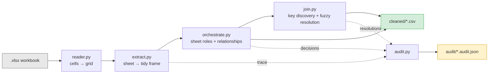
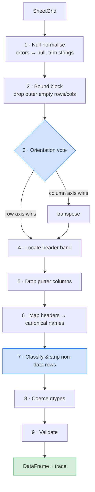
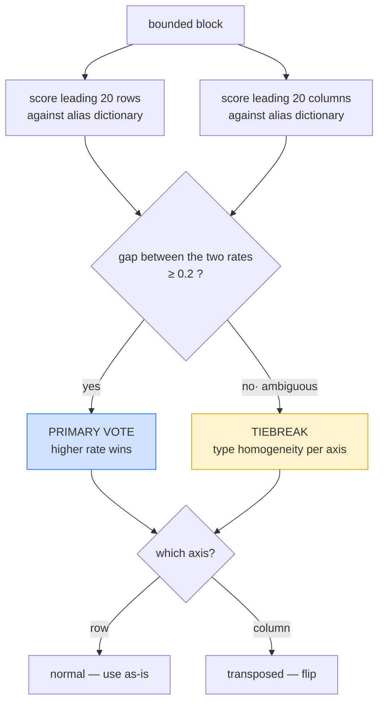
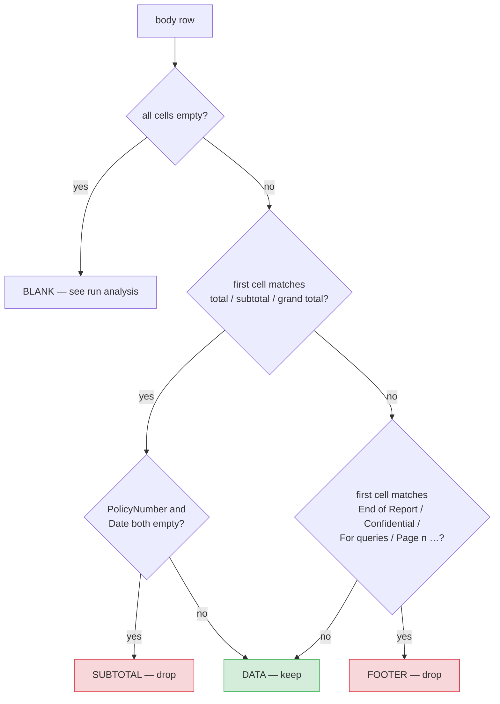
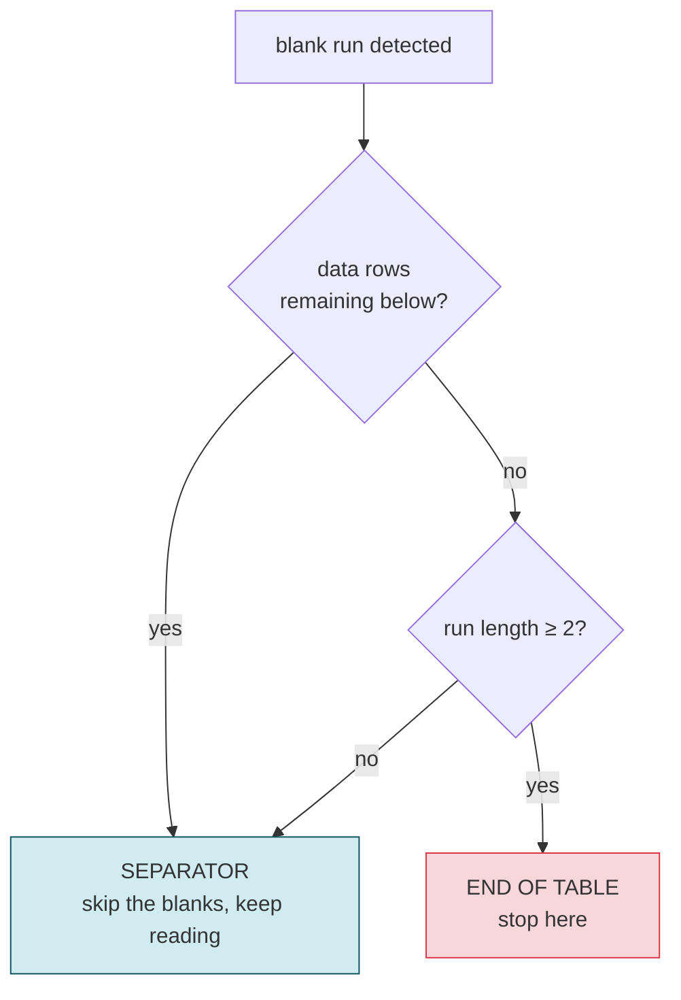
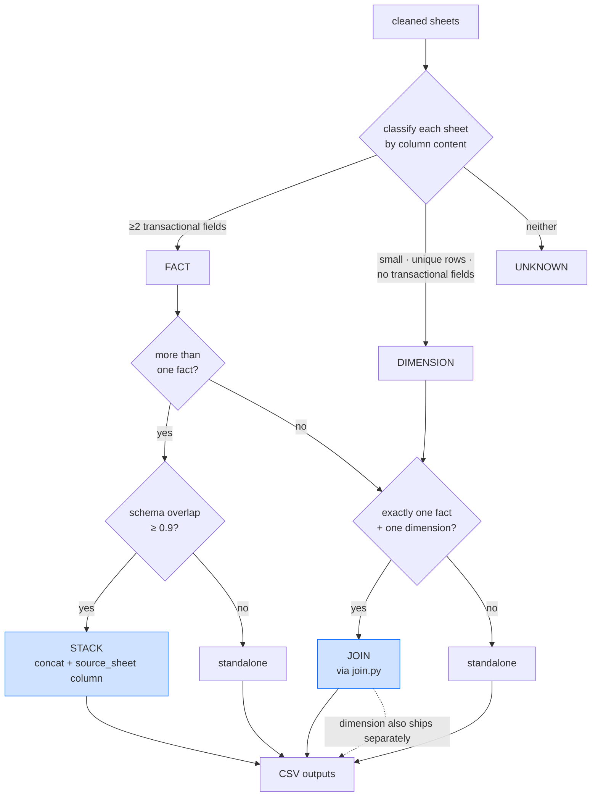
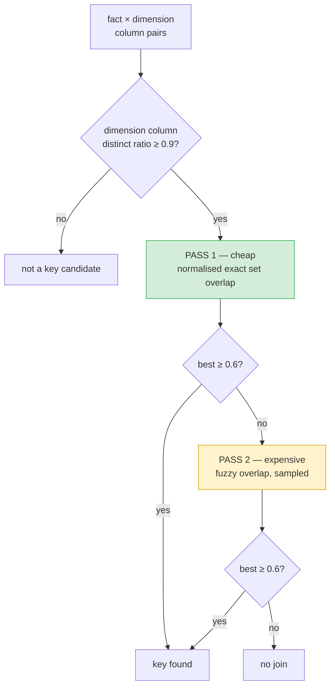
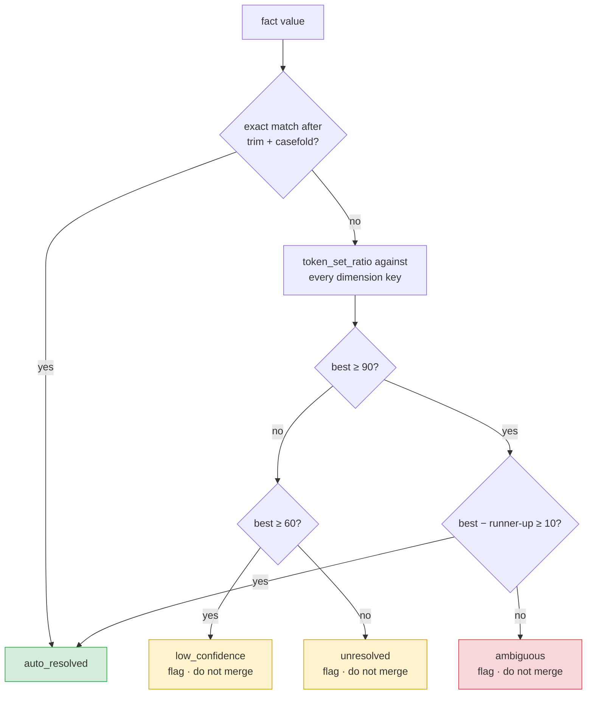

# Architecture — AHI Excel Cleaning Pipeline

Technical reference for the pipeline that converts report-shaped Excel exports into
table-ready CSVs.

**Design principle:** no per-file configuration. Every structural decision is derived from
cell content at runtime, so an unseen file is handled by the same code path as a known
one. Every decision is written to an audit trail.

---

## 1. System overview



Two layers do the work:

| Layer | Scope | Question it answers |
|---|---|---|
| **Extraction** (`extract.py`) | one sheet | Where is the table, which way up is it, which rows are real? |
| **Orchestration** (`orchestrate.py`, `join.py`) | whole workbook | What is each sheet, and how do they relate? |

`schema.py` is the shared reference both layers consult — the canonical field names, their
aliases, and their target dtypes. It is the single source of truth and the only file that
changes when the target schema changes.

---

## 2. Module responsibilities

| Module | Responsibility | Key exports |
|---|---|---|
| `schema.py` | Canonical fields, alias dictionary, target dtypes | `match_aliases()`, `dtype_of()` |
| `typing_utils.py` | Fine-grained cell type inference, homogeneity scoring | `infer_type()`, `mean_homogeneity()` |
| `reader.py` | Workbook → dense cell grid; nulls Excel error cells | `read_workbook()`, `SheetGrid` |
| `extract.py` | The 9-step extraction pipeline for one sheet | `extract_sheet()` → `SheetResult` |
| `orchestrate.py` | Sheet role classification, stack/join decisions | `plan_workbook()` → `[Output]` |
| `join.py` | Value-based key discovery, fuzzy resolution | `discover_key()`, `join_frames()` |
| `audit.py` | Assemble and write the JSON report | `build_report()`, `write_report()` |
| `cli.py` | Argument parsing, file I/O orchestration | `clean_workbook()`, `main()` |

---

## 3. Extraction pipeline (one sheet)



Order is load-bearing in two places:

- **Step 3 before step 4.** The header hunt only makes sense once the sheet is the right
  way up.
- **Step 5 after step 4.** Gutter columns can only be identified as "empty in the header
  *and* in every data row" once the header is known. File1's column F is empty top to
  bottom but sits *between* two real header cells — dropping empty columns before finding
  the header would work here, but would break on a file where a column is empty only in
  the banner region.

### Step 1 — null normalisation

`reader.py` coerces any cell with `data_type == 'e'` to null. Excel error values come back
from openpyxl as ordinary strings (`'#VALUE!'`), so left alone they read as *populated*
and defeat blank-row detection.

> File2!A1 holds `#VALUE!`, merged across A1:D2, sitting under the embedded logo. Without
> this step the header hunt anchors to row 1.

Strings are also trimmed here, which is what turns File6's `'MJC '` into `'MJC'` before
anything tries to join on it.

Embedded images are counted from the `.xlsx` zip for the audit report only. They are
anchored to the drawing layer, not to cells, so they are invisible to any value-based
scan — the report records them so a reviewer understands why the top of a sheet looked
empty.

---

## 4. Orientation detection (step 3)



**Primary vote — alias match rate.** The target schema is known ahead of time, so the axis
whose leading lines read as a list of *field names* is the field axis. Empty cells are
excluded from the denominator, so a header with a gap is not penalised.

A **band** of leading lines is scored, not just line 1: a banner can sit above the header.
Scoring only row 1 made File2 fall through to the tiebreaker, because that sheet's first
row is the `Exavalu` title.

**Tiebreaker — type homogeneity.** In a normal table each *column* holds one type while
each row is mixed. In a transposed table this is reversed. Only consulted when the alias
vote is within 0.2, where it is least likely to mislead.

This requires a **fine-grained type lattice**. Five of the eight canonical fields are
strings, so under a coarse `{str, num, date}` classification rows and columns both look
string-homogeneous and the signal collapses. `typing_utils.infer_type` therefore separates
strings by shape:

```
empty · bool · int · float · date · datetime · date_string · id_string · text
```

`POL-1000001` is `id_string`, `2026-01-01` is `date_string`, `Metro Agency Group` is
`text` — three distinct types where a coarse lattice sees one.

### Measured on the samples

| Sheet | row rate | col rate | decided by | result |
|---|---|---|---|---|
| File1 Data | 1.00 | 0.09 | alias_match | normal |
| File2 Data | 1.00 | 0.09 | alias_match | normal |
| File3 Sheet | 1.00 | 0.07 | alias_match | normal |
| **File4 Sheet** | **0.09** | **1.00** | **alias_match** | **transposed** |
| File5 Jan/Feb | 1.00 | 0.09 | alias_match | normal |
| File6 Report | 1.00 | 0.09 | alias_match | normal |
| File6 Producer | 1.00 | 0.17 | alias_match | normal |

Every sheet is decided by the primary vote with a ≥0.8 margin. The tiebreaker is
implemented and tested but does not fire on this corpus.

---

## 5. Header location (step 4)

Each of the first 20 rows is scored by alias match rate; the highest wins, ties resolving
to the topmost row.

Two naive rules that **do not** work:

| Naive rule | Breaks on |
|---|---|
| "first populated row" | File2 — the `Exavalu` banner wins |
| "first row with no blanks" | File1 — the header spans B2:J2 with F2 empty |

If no row scores above zero the first row is used as a fallback and a note is written to
the trace, so a schema the dictionary does not know still produces output rather than an
exception.

---

## 6. Row classification (step 7)



**The whole body is scanned**, not just the tail. File3's subtotals sit *between* the
groups they summarise, so a trim-from-the-bottom approach misses them entirely.

**A total row must satisfy two conditions**: name itself in its first cell *and* leave the
record-identifying columns (`policy_number`, `accounting_effective_date`) empty. The
second condition is what lets a profit centre legitimately named `Total Risk PC` survive —
it carries a policy number, so it is data. Covered by
`test_a_total_row_that_carries_a_policy_number_is_kept`.

### Blank-run analysis

A blank row is ambiguous: it can be a cosmetic separator or the end of the table.



File1 row 8 is a single blank with five more records below it. Treating it as a terminator
would silently discard half the file.

### What the samples produce

| File | Dropped | Classifications |
|---|---|---|
| File1 | 1 | `SEPARATOR ×1` |
| File2 | 6 | `BANNER ×3`, `FOOTER ×2`, `SUBTOTAL ×1` |
| File3 | 3 | `SUBTOTAL ×3` |
| File4–6 | 0 | — |

---

## 7. Type coercion (step 8)

Dtypes are **decided by the schema, not inherited from the source**, because the same
field is stored differently in different files.

| Field | Source variation | Output | Why |
|---|---|---|---|
| `profit_center_number` | `1005` (numeric) / `'PC0001'` (text) | **string** | An identifier, not a quantity. Only a string survives both forms. |
| `accounting_effective_date` | `'2026-01-01'` (text) / real `datetime` | **ISO date string** | One representation for a single downstream table. |
| `commission_pct` | `11.06` | **float, unchanged** | Already a whole-number percent. No silent ÷100. |
| `zip_code` | `8085` (numeric) | **5-wide string** | Excel already dropped the leading zero of `08085`; restored by width. |
| `premium` | numeric | **float64** | — |

Nothing is coerced with `errors='coerce'`. Every value that fails to parse is recorded in
`coercion_failures` with the column, the value and the reason, then nulled — a failure is
a reviewable event, not a silent one.

---

## 8. Workbook orchestration



### Sheet roles

| Role | Test | Example |
|---|---|---|
| `FACT` | ≥2 of `premium`, `policy_number`, `accounting_effective_date`, `commission_pct` | File6 `Report` |
| `DIMENSION` | ≤200 rows, every row a unique entity, no transactional fields | File6 `Producer` |
| `UNKNOWN` | neither | — |

**Sheet names are recorded as a hint, never used to decide.** A sheet tabbed `Producer
Lookup` that holds transactional rows is classified `FACT`. Covered by
`test_a_lookup_named_sheet_holding_transactions_is_still_a_fact`.

### Stacking

Schema overlap is the Jaccard index of the canonical fields present on each sheet. File5's
Jan and Feb score 1.0.

A `source_sheet` column is inserted during the concat. This is not cosmetic: **nothing in
the row data identifies the period**, and Jan and Feb reuse the same policy numbers
(`POL-200001`…`POL-200010`). Without it the stacked rows are indistinguishable and read as
duplicates.

For the same reason, **uniqueness checks are scoped within a sheet**, before stacking. A
global check would flag all 20 rows and a naive dedupe would destroy half the dataset.

---

## 9. Join key discovery and resolution



**Keys are found from values, never from header names.** `producer_agency_name` and
`producer` do not string-match, and on a wider schema name-matching cheerfully picks the
wrong column.

**Two passes, for cost.** All-pairs fuzzy comparison is
`O(cols_A × cols_B × |values_A| × |values_B|)` and would be the pipeline's bottleneck at
scale. The cheap normalised-exact pass settles File6 outright at 0.8 overlap — fuzzy
scoring never runs.

### Value resolution — the margin rule



**Why an absolute threshold is not enough.** `token_set_ratio` returns 100 whenever one
side's token set is a subset of the other's. A truncated or generic value therefore clears
any absolute threshold against *several* dimension entries at once, and `max()` silently
picks whichever it saw first:

```
'MJC '         → MJC Agency Group = 100 , Metro Agency Group =  10   margin 90  ✓ resolve
'Agency Group' → Metro Agency Group = 100 , MJC Agency Group = 100   margin  0  ✗ flag
'Brown & Brown'→ Apex Insurance Brokers = 34                          below 60  ✗ flag
```

The margin rule is the difference between a join you can trust and one you cannot. Covered
by `test_a_value_that_ties_two_candidates_is_flagged_not_guessed`.

**Joins are always `how='left'`.** A fact row never disappears because its lookup missed;
the dimension columns come back null and the value is listed under `needs_human_review`.

---

## 10. Audit trail

One JSON per workbook in `audit/`. This is what makes the cleaning reviewable rather than
a black box.

```
{
  "source_file", "generated_at", "embedded_images",
  "sheets": [ {
      "orientation":  { row_alias_rate, column_alias_rate, decided_by, orientation },
      "header":       { row_index, alias_rate, scores[] },
      "error_cells_nulled", "merged_ranges", "column_mapping", "unmapped_columns",
      "dropped_rows": [ { row_index, classification, content } ],
      "coercion_failures", "validation"
  } ],
  "workbook": {
      "sheet_roles":   [ { sheet, role, reason, fact_signal_fields, name_hint } ],
      "relationships": [ { sheets, schema_overlap, decision, discovered_key } ],
      "join":          { join_key, discovery, resolutions[], needs_review[] }
  },
  "outputs": [ { file, kind, source_sheets, rows, columns } ],
  "summary": { rows_dropped, dropped_by_classification, coercion_failures,
               validation_findings, join_values_needing_review },
  "needs_human_review": [ ... ]
}
```

`needs_human_review` is the field to check after a run. It is empty for all six samples.

---

## 11. Verification strategy

**The junk the pipeline strips is the oracle for the data it keeps.** Subtotal and total
rows are discarded *and* retained in the trace, so their declared figures can be checked
against the sums of the cleaned rows — an end-to-end correctness check that needs no
hand-built expected output.

```
File2 grand total   declared 230,712.19   cleaned 230,712.19   ✓
File3 East Zone PC  declared  70,464.59   cleaned  70,464.59   ✓
File3 West Zone PC  declared 107,164.96   cleaned 107,164.96   ✓
File3 North Zone PC declared 102,102.74   cleaned 102,102.74   ✓
```

50 tests across three files:

| File | Covers |
|---|---|
| `test_extract.py` | orientation, header hunt, row classification, dtypes, reconciliation |
| `test_join.py` | key discovery, the margin rule, left-join safety |
| `test_orchestrate.py` | sheet roles, stacking, joining, CLI end-to-end, audit content |

```bash
python -m pytest
```

---

## 12. Known limits

| Limit | Consequence |
|---|---|
| Alias dictionary drives orientation and header detection | A workbook with a schema absent from `schema.py` falls back to type homogeneity alone, then to "first row is the header". Output is still produced; confidence is lower. |
| Stacking compares adjacent fact sheets pairwise | A workbook mixing two *different* stackable groups ships them standalone rather than forming two stacks. |
| Join handles one fact + one dimension | Multiple lookups on one fact table are not chained. Deliberate — a transitive join planner is beyond POC scope. |
| Subtotal and footer patterns are English | Localised reports need additional patterns in `extract.py`. |
| Single header row assumed | Multi-row / hierarchical headers are not merged. |
