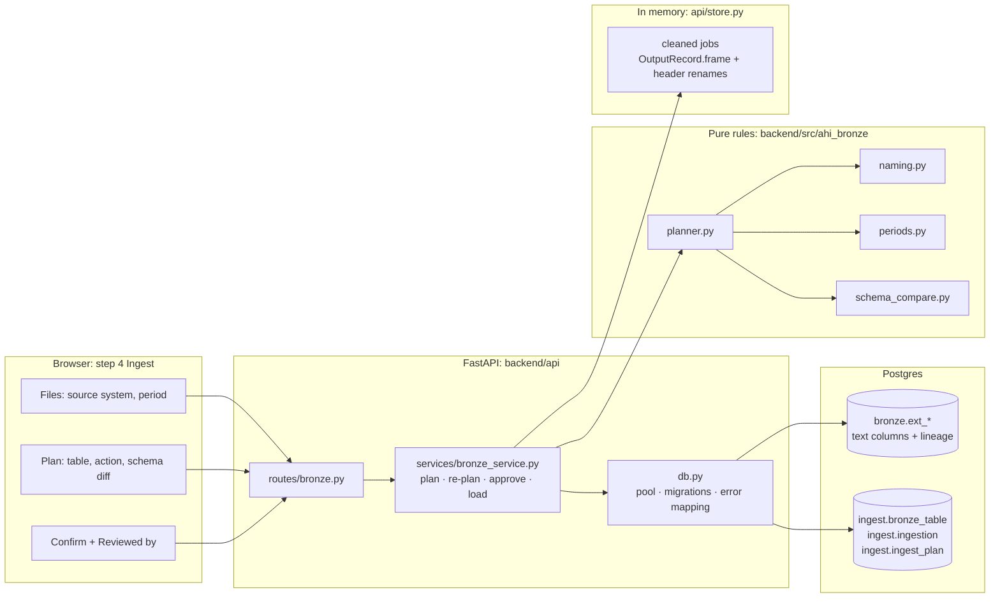
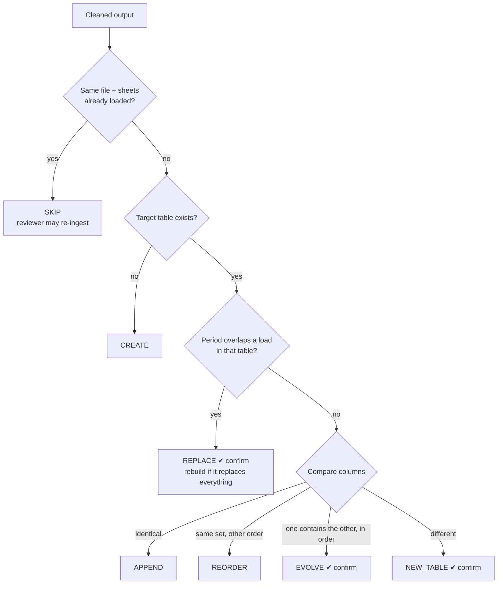

# Enhancement 1: File → Bronze load

How the app automates the manual process in
[`AHI-File-Bronze-Scenario-Doc.docx`](AHI-File-Bronze-Scenario-Doc.docx), with a person approving
every decision that can lose or reshape data.

> **In one line:** cleaned tables are matched against what the bronze layer already holds. Each
> gets one action (create, append, reorder, evolve, replace, new table, skip), and the whole plan
> is loaded into Postgres in one transaction after a reviewer approves it.

**Contents:**

1. [The business problem](#1-the-business-problem)
2. [Requirement → solution](#2-requirement--solution)
3. [Architecture](#3-architecture)
4. [Data model](#4-data-model)
5. [How a plan is decided](#5-how-a-plan-is-decided)
6. [Human in the loop](#6-human-in-the-loop)
7. [Loading: one transaction](#7-loading-one-transaction)
8. [Using it](#8-using-it)
9. [Configuration](#9-configuration)
10. [API](#10-api)
11. [Testing](#11-testing)
12. [Limits and open items](#12-limits-and-open-items)

---

## 1. The business problem

Monthly Excel files arrive per source system. Until now a person decided, for each file:

- **which bronze table** it belongs in, and what to call that table;
- **whether to append** to it, adapt it, or start a new one when the columns changed;
- **whether it replaces** a file already loaded: a revised Jan–Jun file, or a Jan–Jul file after Jan–Jun.

Those decisions are rule-based, so they can be automated. But a wrong replace deletes data and a wrong schema change reshapes a table, so the risky ones must still be confirmed by a person. The automation therefore *proposes*, and a reviewer *disposes*.

The upstream problem, turning a report-shaped workbook into a clean table, is solved by the existing cleaner (see [ARCHITECTURE.md](../ARCHITECTURE.md) §1–14). This enhancement starts from its output.

---

## 2. Requirement → solution

Every statement of the scenario document, where it is implemented, and the test that proves it. Paths are relative to `backend/`.

### Files received for January–June

| # | Requirement (scenario document) | How it is solved | Code | Test |
|---|---|---|---|---|
| B1 | **Single file, single sheet:** a single table is created | No table by that name exists, so **CREATE** | `planner._plan_one` | `test_single_file_single_sheet_creates_one_table` |
| B2 | **Single file, multiple sheets, same schema:** one table | The cleaner stacks sheets with identical cleaned headers into one output with a `source_sheet` column (`orchestrate.plan_workbook`). One output means one table. | `ahi_clean/orchestrate.py` | `test_bronze_db` (`Jan`/`Feb` workbook → `ext_pc0094_data`) |
| B3 | **Single file, multiple sheets, different schemas:** one table per distinct schema | Different headers give separate outputs. Each is planned on its own; a name already taken with different columns becomes a separate table. | `planner._existing`, `_new_table` | `test_multiple_files_different_schemas_get_one_table_each` |
| B4 | **Multiple files, same schema:** one table | Files are planned oldest period first against a running picture of the bronze layer (`_record`), so the second file sees the first file's table and **APPENDs** | `planner.plan`, `_record` | `test_multiple_files_same_schema_share_one_table` |
| B5 | **Multiple files, different schemas:** one table per file | The second file's columns differ, so **NEW_TABLE** with a suffixed name | `planner._new_table` | `test_multiple_files_different_schemas_get_one_table_each` |
| B6 | **A revised Jan–Jun file:** confirmation required; then the previous version is deleted and the revised file ingested | Its period overlaps a load already in the table, so **REPLACE** with `requires_confirmation`. On approval the old load's rows are deleted by `_ingestion_id` and its audit row marked `superseded`. | `planner._existing`, `bronze_service._load` | `test_revised_jan_jun_file_replaces_after_confirmation`, `test_bronze_db` |

### File received for July

| # | Requirement | How it is solved | Code | Test |
|---|---|---|---|---|
| B7 | **Scenario 1, case 1:** identical names, order and count: append | `schema_compare.compare` gives IDENTICAL, so **APPEND** | `schema_compare.py` | `test_case_1_identical`, `test_july_identical_appends` |
| B8 | **Case 2:** same names and count, different order: reorder, then append | REORDERED, so **REORDER**. Rows are written in the table's own column order (`COPY` with the table's column list). | `schema_compare.py`, `bronze_service._load` | `test_july_reordered_reorders_then_appends` |
| B9 | **Case 3:** same names and order, different count: schema evolution, then append | EVOLVED when one column list is the other with columns added or left out, in the same order. **EVOLVE** runs `ALTER TABLE ADD COLUMN` for new ones; columns missing from the file load as NULL. **Confirmed.** | `schema_compare.compare`, `_in_order` | `test_case_3_…`, `test_july_extra_column_evolves_and_needs_confirmation` |
| B10 | **Case 4:** different schema: a separate table with only the July data | DIFFERENT, so **NEW_TABLE** `…_2026_07`. **Confirmed.** | `planner._new_table` | `test_case_4_different_schema`, `test_july_different_schema_goes_to_its_own_table` |
| B11 | **Scenario 2:** the second file is Jan–Jul. Confirmation required; the old Jan–Jun file is discarded and the new one ingested. | Jan–Jul overlaps Jan–Jun, so **REPLACE**. If it replaces every load in the table, the table is rebuilt with the new file's columns. **Confirmed**, with a final "Replace existing data?" dialog. | `planner._existing` (`rebuild`) | `test_jan_jul_file_replaces_jan_jun`, `test_bronze_db` |

### Bronze table naming

| # | Requirement | How it is solved | Code | Test |
|---|---|---|---|---|
| B12 | `ext_[source_system]_[sheet_name]`, e.g. `ext_pc0515_arr` | `naming.table_name`. The source system code is dropped from the sheet part if repeated (a CSV's only "sheet" is its file name). | `ahi_bronze/naming.py` | `test_table_names_follow_the_convention` |
| B13 | The source system is added by the team as a suffix to the file name | `source_system_from_filename` takes the last `letters + digits` token of the file stem (`ARR_pc0515.xlsx` → `pc0515`, `pc_002_x.xlsx` → `pc002`). The regex is configurable. **The reviewer can edit it.** | `naming.py`, `AHI_SOURCE_SYSTEM_PATTERN` | `test_source_system_comes_from_the_file_name_suffix` |
| B14 | A sheet named after a date or month (Jan, Feb, June) uses a generic name: `ext_[source_system]_data` | `has_period` recognises month names, `2024-07`, `07-2024`, `07/31/2024`, quarters, `FY24` and years, whole-word only (`Market` is not March). Several stacked sheets also get `_data`. | `naming.has_period` | `test_table_names_follow_the_convention` |
| B15 | "Alternatively, use another suitable generic name" | **The reviewer can rename any table** in the plan. Names must start with `ext_` and are cut to Postgres's 63-character limit with a hash suffix. | `bronze_service.update_item`, `naming.identifier` | `test_reviewer_table_name_is_used` |

### What the document implies but doesn't spell out

| Need | How it is solved |
|---|---|
| **Knowing which period a file covers** (needed for append vs replace) | `periods.detect` reads the accounting / transaction date columns first, then month-named sheets. It shows its evidence and the reviewer confirms. A file with no detectable period is **blocked** until a period is entered. |
| **The same file sent twice** | A load is identified by the file's SHA-256 plus the sheets it came from, so a repeat is **SKIPPED** (the reviewer may choose to re-ingest). The same file twice in one batch is loaded once. |
| **Knowing what is already in bronze** | `ingest.bronze_table` (registry) and `ingest.ingestion` (the audit table that Silver later reads) |
| **Not corrupting a table someone else changed meanwhile** | Before writing, each table's columns are checked against what the plan assumed, and on approval the plan is rebuilt. Any difference refuses approval (`plan_changed`). |

---

## 3. Architecture

**Design principles:**

- **Rules are pure.** `ahi_bronze` has no I/O. The same inputs and the same reviewer overrides always give the same plan, so all of §2 is unit-tested without a database.
- **The service orchestrates.** It reads cleaned outputs from the in-memory job store, reads the registry, asks the planner, keeps the plan, applies edits by re-planning, and runs approved plans.
- **What was reviewed is what loads.** Rows come from the cleaned frame with the reviewer's header renames applied, exactly as the CSV export would contain them.

---

## 4. Data model

**Bronze tables** (`AHI_BRONZE_SCHEMA`, default `bronze`): one per `ext_…` name.

| Column | Meaning |
|---|---|
| *(the file's columns)* | **All `text`.** Bronze is the raw landing zone, so a later file can never conflict on type; typing is Silver's job. |
| `_ingestion_id` | Which load wrote the row. A replace deletes by it. |
| `_source_file`, `_source_sheet` | Lineage (`_source_sheet` is taken from `source_sheet` for stacked month sheets, even if renamed) |
| `_ingested_at` | When |

**Control tables** (`AHI_CONTROL_SCHEMA`, default `ingest`; created by `backend/migrations/001_control_tables.sql`):

| Table | Holds |
|---|---|
| `bronze_table` | Registry: each table's columns **in order**, with the cleaner's datatype, and its source system |
| `ingestion` | **The ingestion audit table:** one row per file loaded or skipped. It holds the table, file, SHA-256, source sheets, period, action, schema diff, rows loaded, status (`ingested` / `superseded` / `skipped`), what superseded it, and the reviewer. Silver reads its eligibility from here. |
| `ingest_plan` | Every approved plan, as the reviewer saw it, and whether it succeeded |

---

## 5. How a plan is decided

- **Order:** outputs are planned **oldest period first**, then by file, then the **larger table first**. When two tables of one sheet compete for a name, the main table keeps it and a side lookup table gets the suffix.
- **Reviewer overrides:** an action can be changed only to one of the item's `allowed_actions`, for example keeping the old load and appending instead of replacing.
- **Blockers:** a missing source system or period blocks approval.

---

## 6. Human in the loop

| Gate | Why a person decides |
|---|---|
| Source system and period, per file | Both are inferred (file name, dates). Both are shown with their evidence and can be edited. |
| Table name | The document allows "another suitable generic name" |
| **REPLACE** | Deletes data. Needs a per-item tick and a final dialog listing exactly which loads will be deleted. |
| **EVOLVE** | Changes a table's structure |
| **NEW_TABLE** beside an existing table | The document's case 4. A person confirms it really is a different schema. |
| Any reviewer override | A deliberate departure from the rules |
| Reviewer name | Recorded on every audit row |

**Confirmations bind to what was confirmed.** If an item's action, target or replaced loads change, its tick is cleared in the UI. On approval the server rebuilds the plan, and refuses with `plan_changed` if anything confirmed is no longer what would run.

---

## 7. Loading: one transaction

`bronze_service._execute` runs the whole plan in **one** Postgres transaction, so either every table loads or none does:

1. `pg_advisory_xact_lock('ahi-bronze')`, so plans never interleave.
2. For each item:
   1. Re-check the table's columns against the plan.
   2. `CREATE`, `ALTER TABLE ADD COLUMN`, or drop and recreate (rebuild).
   3. `DELETE` the replaced loads' rows.
   4. `COPY … FROM STDIN` in the table's column order.
   5. **Count the rows** and roll back on a mismatch.
   6. Upsert the registry and write the `ingestion` row.
   7. Mark the replaced loads `superseded`.
3. A failure rolls everything back, and the attempt is recorded as `failed` in `ingest_plan`.

---

## 8. Using it

1. **Configure:** upload the workbooks and pick the sheets.
2. **Run:** clean them.
3. **Results:** optionally rename headers.
4. **Ingest:**
   - check each file's **source system** and **period**;
   - review the **plan**: each target table, its action badge, its schema diff, and the reasons;
   - tick the confirmations for risky items, enter **Reviewed by**, and click **Ingest**.
5. **Bronze tables tab:** every table with its columns, row count, period coverage and full load history, including superseded and skipped loads.

---

## 9. Configuration

Set these in `backend/.env` (or `.env`), using `.env.example` as the template:

| Variable | Purpose |
|---|---|
| `AHI_DB_HOST`, `AHI_DB_PORT`, `AHI_DB_NAME`, `AHI_DB_USER`, `AHI_DB_PASSWORD`, `AHI_DB_SSLMODE` | The Postgres database. The Ingest step is locked until these are set. |
| `AHI_BRONZE_SCHEMA` / `AHI_CONTROL_SCHEMA` | Schema names (default `bronze` / `ingest`) |
| `AHI_SOURCE_SYSTEM_PATTERN` | Regex with one capture group, for the file-name suffix |
| `AHI_INGEST_ENABLED` | Set to `false` to hide the step |

---

## 10. API

| Endpoint | Purpose |
|---|---|
| `GET /api/bronze/status` | Whether the database is configured and reachable |
| `POST /api/bronze/plans` | Build a plan from cleaned jobs `{job_ids, batch_id}` |
| `PATCH /api/bronze/plans/{id}/files/{job_id}` | Edit a file's source system or period |
| `PATCH /api/bronze/plans/{id}/items/{key}` | Edit a table name or action |
| `POST /api/bronze/plans/{id}/approve` | `{reviewed_by, confirmed}`. Returns 409 until every blocker is fixed and every risky item confirmed. |
| `GET /api/bronze/plans/{id}` | Progress and result |
| `GET /api/bronze/tables` | Registry with load history |

---

## 11. Testing

- **Rules:** `backend/tests/test_bronze_rules.py` covers every row of §2, with no database.
- **End to end:** `backend/tests/test_bronze_db.py` runs the scenario document through the HTTP API against a real Postgres: create, July cases 1–4, revised file, month sheets, and same file again. Run it with `AHI_TEST_DATABASE_URL=postgresql://… python -m pytest backend/tests -k bronze`.
- **Scenario workbooks:** `enhancements/test-files/`, files 1–4, 9 and 10 (see its README).

---

## 12. Limits and open items

- **Plans live in memory** until approved, like cleaning jobs. A restart means re-planning; what is loaded is safe in Postgres.
- **Period detection** needs date columns or month-named sheets; otherwise the reviewer enters the period.
- **Two sources with the same code** would share tables. The code comes from the file-name suffix convention, so the team's convention is the safeguard.
- **Bronze is untyped by design.** Conversion happens in Silver ([BRONZE_TO_SILVER.md](BRONZE_TO_SILVER.md)).
